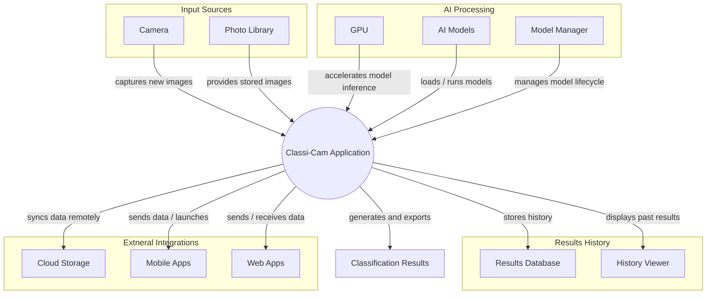

## 2.2 System Context
Below is the context diagram for the Classi-Cam system.

```mermaid
graph TB

    subgraph Input Sources
        camera[Camera]
        photo_lib[Photo Library]
    end
    camera --> |captures new images| Classi-Cam
    photo_lib --> |provides stored images| Classi-Cam

    subgraph AI Processing
        gpu[GPU]
        ai_model[AI Models]
        model_mgr[Model Manager]
    end
    gpu --> |accelerates model inference| Classi-Cam
    ai_model --> |loads / runs models| Classi-Cam
    model_mgr --> |manages model lifecycle| Classi-Cam

    Classi-Cam((Classi-Cam Application))

    results[Classification Results]
    Classi-Cam --> |generates and exports| results

    subgraph Results History
        results_db[Results Database]
        hist_viewer[History Viewer]
    end
    Classi-Cam --> |stores history| results_db
    Classi-Cam --> |displays past results| hist_viewer

    subgraph Extneral Integrations
        cloud[Cloud Storage]
        mobile_app[Mobile Apps]
        web_app[Web Apps]
    end
    Classi-Cam --> |syncs data remotely| cloud
    Classi-Cam --> |sends data / launches| mobile_app
    Classi-Cam --> |sends / receives data| web_app

```

