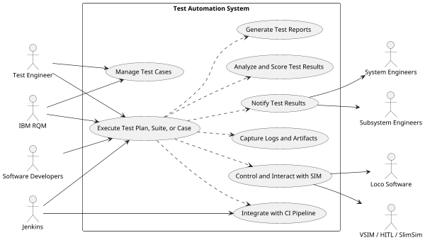

## 2.3 Functions

### 2.3.1 Actors
Listed below are the primary, supporting, and offstage actors for the Test Automation system.

| Type              | Actor                              | Goal Description                                               |
| ----------------- | ---------------------------------- | -------------------------------------------------------------- |
| Primary Actors    | Test Engineer                      | Validate system functionality and requirements through testing |
|                   | Software Developers                | Test and validate code modules meet requirements               |
|                   | Jenkins                            | Automatically execute test suites                              |
|                   | IBM RQM                            | Enable test execution and collect test results                 |
| Supporting Actors | System Engineers                   | Evaluate design through test pass/fail status                  |
|                   | Subsystem Engineers                | Verify subsystems meet design specifications                    |
|                   | Locomotive Control System Software | Demonstrate functionality via testing                          |
|                   | VSIM                               | Provide virtual test execution environment                     |
|                   | HITL                               | Enable hardware testing scenarios                              |
|                   | SlimSIM                            | Simulate locomotive behaviors                                  |
|                   | IBM DOORS NG                       | Provide requirements traceability                              |
| Off-Stage Actors  | Locomotive                         | Safe and reliable operation                                    |
|                   | FRA/AAR                            | Certify systems meet regulatory standards                      |
|                   | Customer                           | Reliable and high-performing locomotive                        |

### 2.3.2 System Functions / Use Cases
The high level functions of the Test Automation system are listed in the table below.

| Use Case | 
Use Case Name
 | Description                                                                                                                                         |
| -------- | ---------------------------------------------- | --------------------------------------------------------------------------------------------------------------------------------------------------- |
| UC-1    | **Execute Test Plan, Suite, or Case**           | Execute a comprehensive regression test suite for the locomotive control system software, covering both functional and non-functional requirements. |
| UC-2    | **Manage Test Cases**                           | Provide the ability to create, update, and maintain test cases, including the ability to organize them into logical test suites and test plans.     |
| UC-3    | **Generate Test Reports**                       | Generate detailed test reports, including information about test execution, results, and any identified defects or issues.                           |
| UC-4    | **Integrate with CI Pipeline**                  | Integrate with the CI pipeline, enabling automated execution of regression tests as part of the software build and deployment process.              |
| UC-5    | **Control and Interact with HIL/VSIM**          | Control and interact with the various hardware components (sensors, actuators, controllers) during the testing process.                             |
| UC-6    | **Capture Logs and Artifacts**                  | Capture detailed logs and artifacts from the test execution process                                                                                 |
| UC-7    | **Notify Test Results**                         | Notify users about the results of the regression test suite execution, including any failed or blocked test cases.                                  |
| UC-8    | **Analyze and Score Test Results**              | Analyze the test results, score and categorize test cases as pass or fail based on predefined criteria.                                              |

Shown below is the system level use case diagram for the Test Automation framework.

### 2.3.3 Detailed Test Automation Functions
These functions are more detailed or lower level requirements / functionality for the test automation framework.

| Use Case | 
Use Case Name
         | Description                                                                                                                                                                                                     |
| -------- | :----------------------------------------------------- | :-------------------------------------------------------------------------------------------------------------------------------------------------------------------------------------------------------------- |
| UC-9     | **set/get/override plant model signal, gain, or bias** | Manipulate the simulation environment's plant model parameters for testing purposes.                                                                                                                            |
| UC-10    | **get/verify monitor parameters**                      | Retrieve and validate the values of various monitoring parameters during test execution.                                                                                                                        |
| UC-11    | **get/verify incident logs**                           | Access and verify the incident logs generated by the locomotive control system.                                                                                                                                 |
| UC-12    | **get/verify operator message block (OMB)**            | Retrieve and validate the operator message block displayed to the user.                                                                                                                                         |
| UC-13    | **set keypress / get keylabel**                        | Simulate user input through key presses and retrieve the corresponding key label information.                                                                                                                   |
| UC-14    | **get screenshot / verify via OCR**                    | Capture screenshots of the user interface and perform optical character recognition (OCR) for verification of text or icons.                                                                                    |
| UC-15    | **download loco data (CUS, ER, etc)**                  | Download and access various locomotive data files, such as CUS (monitor parameter logs) and ER (Event Recorder) files.                                                                                          |
| UC-16    | **power cycle (BCCB, Battery, TCD, etc)**              | Simulate power cycling of different locomotive components, such as BCCB (Battery Charge/Circuit Breaker), BAT (Battery), and TCD (Thin Client Display), etc.                                                    |
| UC-17    | **sim comm loss (3rd party serial devices)**           | Simulate communication loss with third-party serial devices for testing purposes.                                                                                                                               |
| UC-18    | **get/set other virtual models (vEAB, vGPS, vECP)**    | Interact with and configure other virtual models, such as vEAB (virtual Electronically Controlled Air Brake), vGPS (virtual Global Positioning System), and vECP (virtual Electronically Controlled Pneumatic). |
| UC-19    | **get/verify loco config**                             | Retrieve and validate the locomotive configuration settings.                                                                                                                                                    |
| UC-20    | **get/set ECU settings**                               | Access and modify the settings of the Engine Control Unit (ECU).                                                                                                                                                |
| UC-21    | **get DDS message**                                    | Retrieve and analyze messages from the Data Distribution Service (DDS) used for communication.                                                                                                                  |
| UC-22    | **get CAN message**                                    | Access and analyze messages from the Controller Area Network (CAN) bus.                                                                                                                                         |
| UC-23    | **run console commands / get logs**                    | Execute commands in the CIO, SNIO, NIO console and retrieve the corresponding logs.                                                                                                                             |

