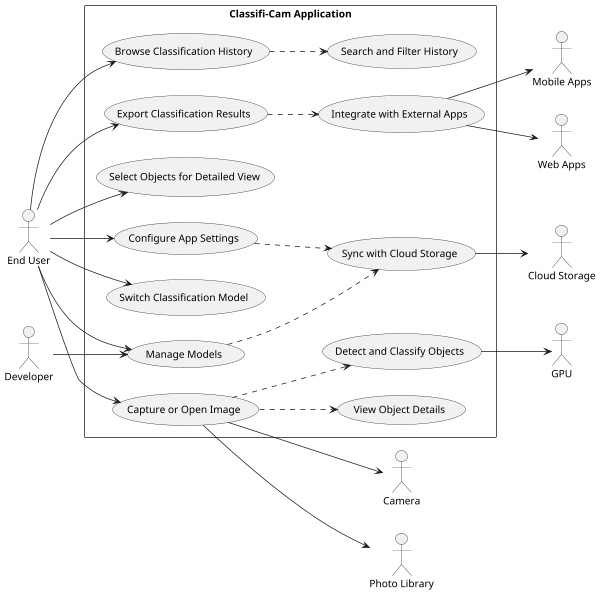

## 2.3 Functions

### 2.3.1 Actors
Listed below are the primary, supporting, and offstage actors for the Classifi-Cam system.

| Type       | Actor                         | Goal Description                                                     |
| ---------- | ----------------------------- | -------------------------------------------------------------------- |
| Primary    | End User                      | Use the app to capture images, classify objects, and manage results. |
|            | Developer                     | Extend the app by adding or updating AI models and plugins.          |
| Supporting | Camera                        | Provide image input for classification.                              |
|            | Photo Library                 | Supply stored images for classification.                             |
|            | GPU                           | Accelerate AI model inference.                                       |
|            | Cloud Storage                 | Sync images and results across devices.                              |
|            | Mobile Apps                   | Receive classification results or triggers.                          |
|            | Web Apps                      | Send and receive classification data.                                |
| Offstage   | Cloud Service Providers       | Host and facilitate cloud storage services.                          |
|            | Privacy Regulators            | Ensure compliance with data protection regulations.                  |
|            | Analytics or Monitoring Tools | Observe system behavior and performance.                             |
|            | App Store Platforms           | Distribute the app and enforce policies.                             |
|            | Third-Party Model Developers  | Provide AI models for use in the system.                             |

### 2.3.2 System Functions / Use Cases
The high level functions of the Classifi-Cam system are listed in the table below.

| Use Case | 
Use Case Name
  | Description                                                                                                                   |
| -------- | ---------------------------------------------- | ----------------------------------------------------------------------------------------------------------------------------- |
| UC-1     | **Capture or Open Image**                      | Allow users to either take a new photo using the device camera or open an existing image from local or cloud storage.         |
| UC-2     | **Detect and Classify Objects**                | Analyze the image to detect and classify objects using the active AI model(s).                                                |
| UC-3     | **Select Objects for Detailed View**           | Enable users to review detected objects, deselect unwanted ones, and choose which to explore in more detail.                  |
| UC-4     | **View Object Details**                        | Display detailed information about selected objects, including classification confidence, metadata, and related content.      |
| UC-5     | **Browse Classification History**              | Allow users to view a gallery of previously scanned images with thumbnails and classification summaries.                      |
| UC-6     | **Manage Models**                              | Enable users or developers to install, update, or remove classification models for specific domains (e.g., food, plants).     |
| UC-7     | **Switch Classification Model**                | Allow users to choose or switch between available active classification models based on their needs or interests.             |
| UC-8     | **Integrate with External Apps**               | Send classification results or triggers to third-party apps or services (e.g., notes, calendars, smart home apps).            |
| UC-9     | **Sync with Cloud Storage**                    | Upload or retrieve images and classification data from Google Drive or iCloud Drive.                                          |
| UC-10    | **Export Classification Results**              | Allow users to export results in various formats (e.g., JSON, CSV, image with annotations) for sharing or analysis.           |
| UC-11    | **Search and Filter History**                  | Provide search and filtering capabilities to find past classifications by date, object type, or tags.                         |
| UC-12    | **Configure App Settings**                     | Let users configure preferences such as default model, storage location, privacy settings, and notification preferences.      |

Shown below is the system level use case diagram for the Classifi-Cam application.

