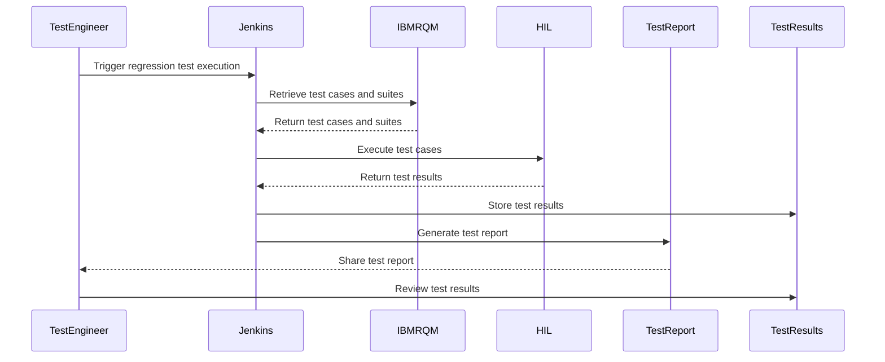
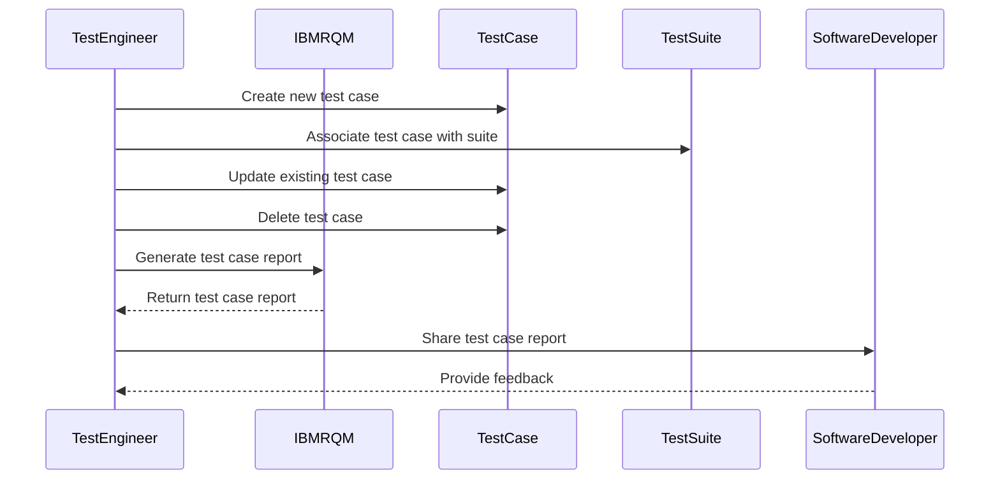
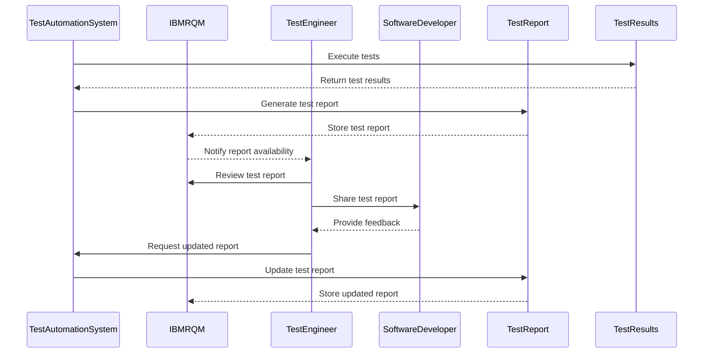
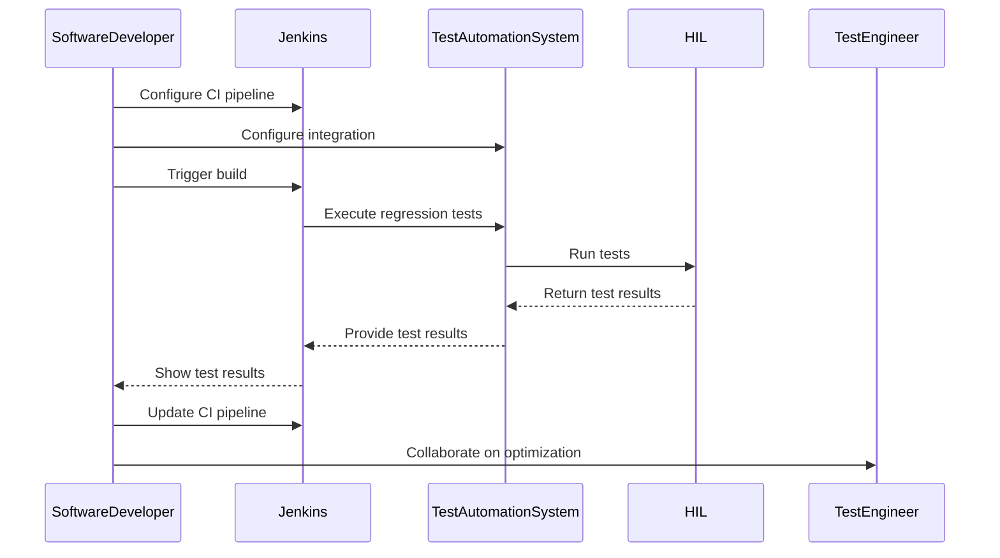
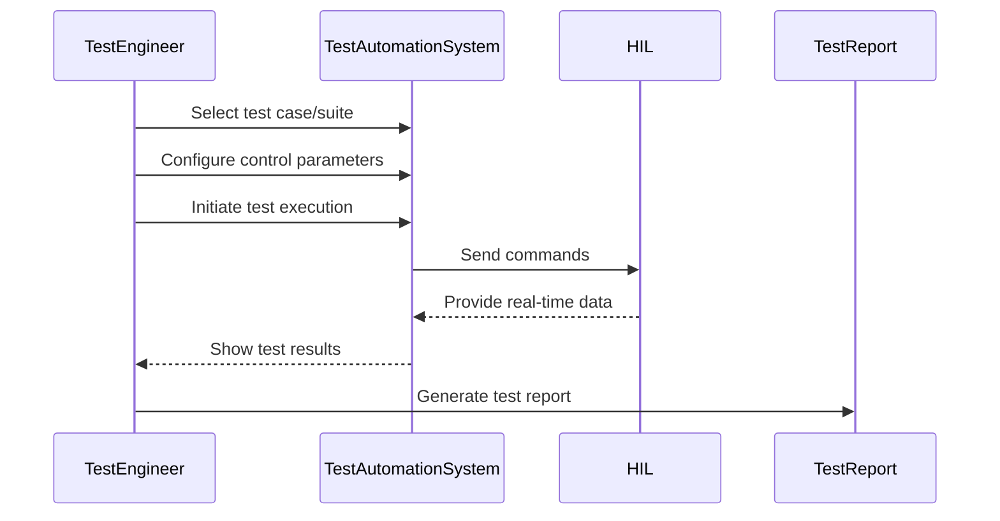
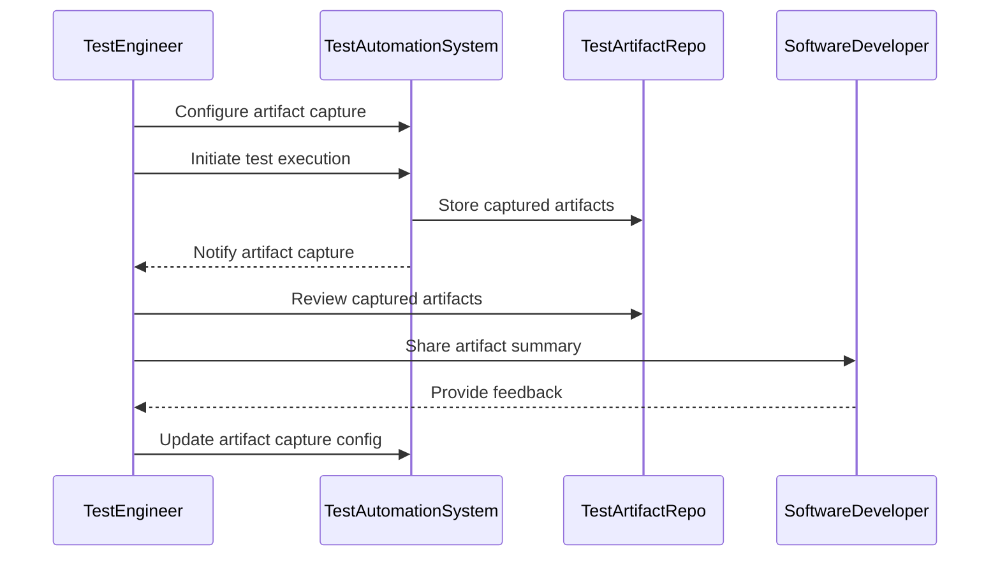
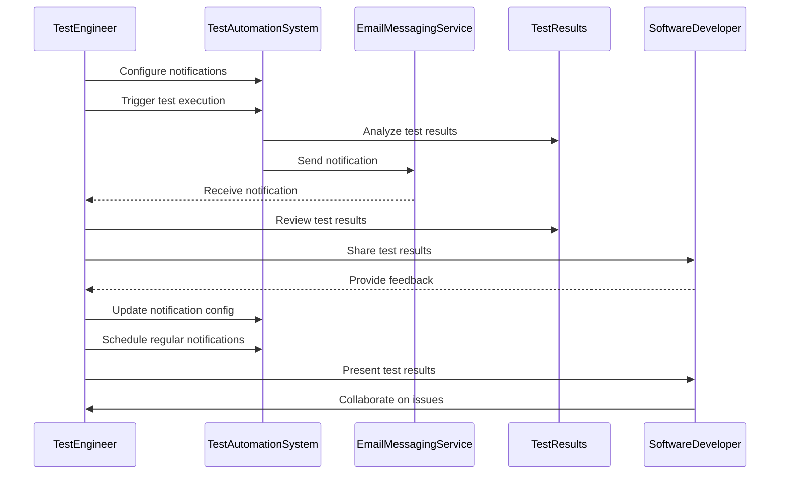

## 3.1 Partially Dressed Use Cases
Listed below are the system use cases described at a high level. 

### **3.1.1 Execute Test Plan, Suite, or Case**
   - **Goal in Context**: A test engineer wants to execute a comprehensive regression test suite for the locomotive control system software, covering both functional and non-functional requirements.
   - **Actors**: Test Engineer, Jenkins, IBM RQM, HIL/VSIM
   - **Preconditions**: The test cases and test suites have been defined and stored in the RQM. The test automation framework is integrated with the CI pipeline.
   - **Scenario Steps**:
    Step 1. The test engineer triggers the regression test execution through the CI pipeline.
    Step 2. Jenkins automatically retrieves the necessary test cases and test suites from RQM.
    Step 3. Jenkins executes the regression test suite by interacting with the test automation framework.
    Step 4. The test automation framework controls and executes the test cases on the HIL/VSIM.
    Step 5. The test results, including pass/fail status and any identified defects, are captured and stored in the Jenkins and RQM.
    Step 6. The test engineer reviews the test report and identifies any issues or failures.

### **3.1.2 Manage Test Cases**
   - **Goal in Context**: A test engineer wants to create, update, and maintain test cases, including the ability to organize them into logical test suites and test plans.
   - **Actors**: Test Engineer, IBM RQM
   - **Preconditions**: The test automation framework is integrated with IBM RQM.
   - **Scenario Steps**:
    Step 1. The test engineer creates a new test case, specifying its description, steps, associated script, and expected results.
    Step 2. The test engineer associates the new test case with one or more existing test suites.
    Step 3. The test engineer updates an existing test case, modifying its description, steps, or expected results.
    Step 4. The test engineer deletes a test case that is no longer needed.
    Step 5. The test engineer generates a report of all test cases and their associated test suites and test plans.
    Step 6. The test engineer shares the test case management report with the software development team.
    Step 7. The software development team reviews the test case management report and provides feedback to the test engineer.

### **3.1.3 Generate Test Reports**
   - **Goal in Context**: The test automation system generates detailed test reports, including information about test execution, results, and any identified defects or issues.
   - **Actors**: Test Automation System, IBM RQM
   - **Preconditions**: The test automation system is configured to capture test results and generate reports.
   - **Scenario Steps**:
    Step 1. The test automation system executes the selected test plan, test suite, or individual test cases.
    Step 2. During the test execution, the test automation system captures the test results, including pass/fail status, execution time, and any identified defects or issues.
    Step 3. Upon completion of the test execution, the test automation system generates a detailed test report based on the captured test results.
    Step 4. The test automation system stores the generated test report as part of the test execution record in the RQM.
    Step 5. The test automation system notifies the test engineer that the test report is available in the RQM.
    Step 6. The test engineer reviews the generated test report as part of the test execution record in RQM.
    Step 7. The test engineer shares the test report with the software development team and other stakeholders by providing a link or reference to the test execution record in RQM.
    Step 8. The software development team reviews the test report and provides feedback to the test engineer.
    Step 9. The test engineer requests the test automation system to execute the test cases again and generate an updated test report.
    Step 10. The test automation system updates the test report in the test execution record in the RQM.

### **3.1.4 Integrate with CI Pipeline**
   - **Goal in Context**: A software developer wants to integrate the test automation framework with the CI pipeline, enabling automated execution of regression tests as part of the software build and deployment process.
   - **Actors**: Software Developer, Jenkins, Test Automation System, VSIM
   - **Preconditions**: The test automation framework is configured to work with the CI pipeline.
   - **Scenario Steps**:
    Step 1. The software developer updates the CI pipeline configuration to include a new step for executing an integration test suite.
    Step 2. The software developer configures the test automation framework integration, specifying the necessary parameters and settings.
    Step 3. The software developer tests the CI pipeline integration by triggering a new build.
    Step 4. Jenkins automatically executes the regression test suite using the test automation framework on a VSIM.
    Step 5. The CI pipeline uses the test results to determine whether the software build can be deployed or if further investigation is required.
    Step 6. The software developer reviews the test results and addresses any issues identified during the regression test execution.
    Step 7. The software developer updates the CI pipeline configuration to ensure the test automation framework integration is maintained for future builds.
    Step 8. The software development team collaborates with the test engineer to optimize the CI pipeline integration.

### **3.1.5 Control and Interact with HIL/VSIM**
   - **Goal in Context**: A test engineer wants to control and interact with the various hardware components (sensors, actuators, controllers) during the testing process.
   - **Actors**: Test Engineer, Test Automation System, HIL/VSIM
   - **Preconditions**: The test automation framework is configured to communicate with the HIL/VSIM.
   - **Scenario Steps**:
    Step 1. The test engineer selects the specific test case or test suite they want to execute.
    Step 2. The test engineer configures the desired control and monitoring parameters for the selected test case or test suite.
    Step 3. The test engineer initiates the test execution, and the test automation framework sends the necessary commands to the HIL/VSIM.
    Step 4. The test engineer observes the real-time data and status updates from the HIL/VSIM during the test execution.
    Step 5. The test automation framework captures the test results, including any identified issues or deviations from the expected behavior.
    Step 6. The test engineer generates a detailed report of the test execution, including the observed results and any identified issues.

### **3.1.6 Capture Logs and Artifacts**
   - **Goal in Context**: A test engineer wants to capture detailed logs and artifacts from the test execution process.
   - **Actors**: Test Engineer, Test Automation System, RQMTestArtifactRepository
   - **Preconditions**: The test automation framework is configured to capture and store test-related artifacts.
   - **Scenario Steps**:
    Step 1. The test engineer configures the artifact capture settings, specifying the types of artifacts to be collected.
    Step 2. The test engineer initiates the test execution, and the test automation framework starts capturing the specified artifacts.
    Step 3. The test automation framework stores the captured artifacts in the RQMTestArtifactRepository.
    Step 4. The test engineer reviews the list of captured artifacts to ensure all the necessary data has been collected.
    Step 5. The test engineer generates a summary report of the captured artifacts.
    Step 6. The test engineer shares the artifact summary report with the software development team and other stakeholders.
    Step 7. The software development team reviews the captured artifacts and provides feedback to the test engineer.
    Step 8. The test engineer updates the artifact capture configuration based on the feedback to improve the data collection process.

### **3.1.7 Notify Test Results**
   - **Goal in Context**: A test engineer wants to be notified about the results of the regression test suite execution, including any failed or blocked test cases.
   - **Actors**: Test Engineer, Test Automation System, Email/Messaging Service
   - **Preconditions**: The test automation framework is configured to send notifications upon test execution completion.
   - **Scenario Steps**:
    Step 1. The test engineer configures the notification preferences, including the recipients, notification channels, and the level of detail to be included.
    Step 2. The test engineer triggers the regression test suite execution.
    Step 3. The test automation framework analyzes the test results and identifies any failed or blocked test cases.
    Step 4. The test automation framework generates a notification, summarizing the test execution results, and sends it to the configured recipients.
    Step 5. The test engineer receives the notification and reviews the test results.
    Step 6. The test engineer identifies any issues or failures and plans for further investigation or remediation.
    Step 7. The test engineer shares the test results notification with the software development team and other stakeholders.
    Step 8. The software development team reviews the test results and provides feedback to the test engineer.
    Step 9. The test engineer updates the notification configuration based on the feedback to improve the communication of test results.
    Step 10. The test engineer schedules regular test result notifications to track the progress of the test automation efforts.
    Step 11. The test engineer presents the test results during team meetings to discuss the overall test results and any necessary actions.
    Step 12. The software development team collaborates with the test engineer to address any issues or concerns raised in the test results notification.

