## 3.1 Partially Dressed Use Cases
Listed below are the system use cases described at a high level.

### **3.1.1 Capture or Open Image**
- **Goal in Context**: An end user wants to capture a new photo or select an existing image for classification.
- **Actors**: End User, Camera, Photo Library, Device Manager, Phone/Computer OS
- **Preconditions**: The app is installed and has permission to access the camera, photo library, and cloud storage.
- **Scenario Steps**:
  1. The user launches the app and selects "Capture" or "Open Image."
  2. If "Capture," the app checks for available camera devices.
  3. If multiple cameras exist, the user selects a device.
  4. The OS prompts for camera permissions if not already granted.
  5. The app displays a live video stream from the selected camera.
  6. The user clicks "Take Photo" to capture an image (pausing the stream).
  7. The user can "Retake" (return to live stream) or "Confirm" the image.
  8. Upon confirmation, the app uses the captured image for inference and displays results.
  9. If "Open Image," the user browses and selects an image from local or cloud storage.
  10. The selected image is used for inference and results are displayed.

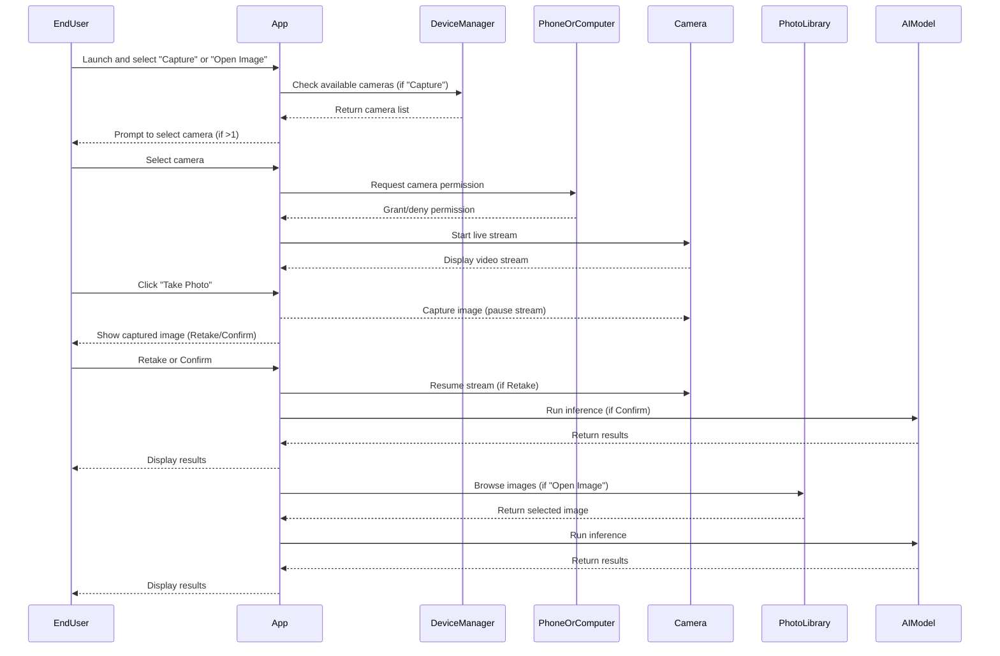
```mermaid
sequenceDiagram
    participant EndUser
    participant App
    participant DeviceManager
    participant PhoneOrComputer
    participant Camera
    participant PhotoLibrary
    participant AIModel

    EndUser->>App: Launch and select "Capture" or "Open Image"
    App->>DeviceManager: Check available cameras (if "Capture")
    DeviceManager-->>App: Return camera list
    App-->>EndUser: Prompt to select camera (if >1)
    EndUser->>App: Select camera
    App->>PhoneOrComputer: Request camera permission
    PhoneOrComputer-->>App: Grant/deny permission
    App->>Camera: Start live stream
    Camera-->>App: Display video stream
    EndUser->>App: Click "Take Photo"
    App-->>Camera: Capture image (pause stream)
    App-->>EndUser: Show captured image (Retake/Confirm)
    EndUser->>App: Retake or Confirm
    App->>Camera: Resume stream (if Retake)
    App->>AIModel: Run inference (if Confirm)
    AIModel-->>App: Return results
    App-->>EndUser: Display results

    App->>PhotoLibrary: Browse images (if "Open Image")
    PhotoLibrary-->>App: Return selected image
    App->>AIModel: Run inference
    AIModel-->>App: Return results
    App-->>EndUser: Display results
```

### **3.1.2 Detect and Classify Objects**
- **Goal in Context**: The user wants to analyze an image to detect and classify objects using the active AI model, and review timing statistics for each processing step.
- **Actors**: End User, AI Model, GPU, External API
- **Preconditions**: An image is selected from the library or captured from the camera, and an AI model is available.
- **Scenario Steps**:
  1. The user initiates object detection and classification (capture or select).
  2. The app loads the image and records load time.
  3. The app preprocesses the image and records preprocessing time.
  4. The app runs inference using the AI model (optionally accelerated by GPU) and records inference time.
  5. The app post-processes results and records post-processing time.
  6. The app displays detected objects with bounding boxes, class labels, and timing statistics for each step.
  7. The user reviews the results and timing breakdown. The user may select a class label to query an external app API for matches, which are then displayed in a list.

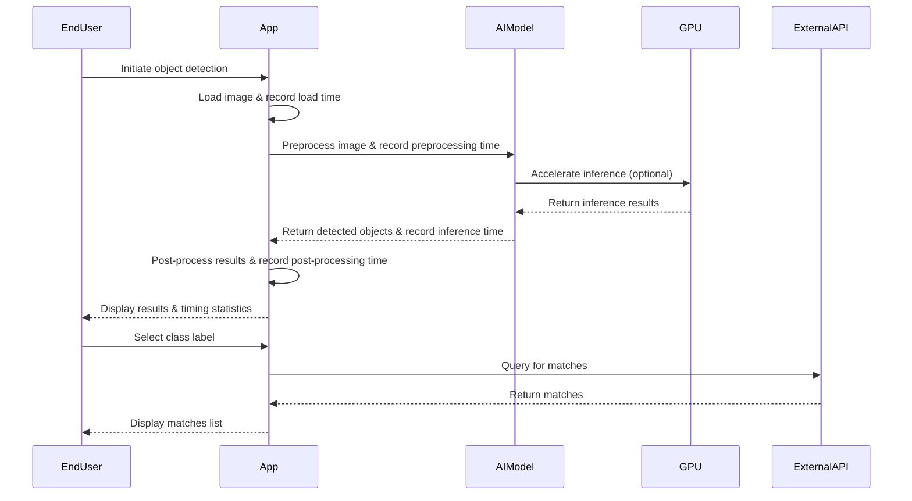
```mermaid
sequenceDiagram
    participant EndUser
    participant App
    participant AIModel
    participant GPU
    participant ExternalAPI

    EndUser->>App: Initiate object detection
    App->>App: Load image & record load time
    App->>AIModel: Preprocess image & record preprocessing time
    AIModel->>GPU: Accelerate inference (optional)
    GPU-->>AIModel: Return inference results
    AIModel-->>App: Return detected objects & record inference time
    App->>App: Post-process results & record post-processing time
    App-->>EndUser: Display results & timing statistics
    EndUser->>App: Select class label
    App->>ExternalAPI: Query for matches
    ExternalAPI-->>App: Return matches
    App-->>EndUser: Display matches list
```

### **3.1.3 Show Matches for Selected Objects**
- **Goal in Context**: The user wants to see best-fit matches or related content for selected objects.
- **Actors**: End User, External API
- **Preconditions**: Objects have been detected and classified in the image.
- **Scenario Steps**:
  1. The user selects one or more detected objects.
  2. The app queries an external API or local database for matches.
  3. The app displays a list or grid of matches related to the selected objects.
  4. The user selects a match from the list to view details (see 3.1.4).

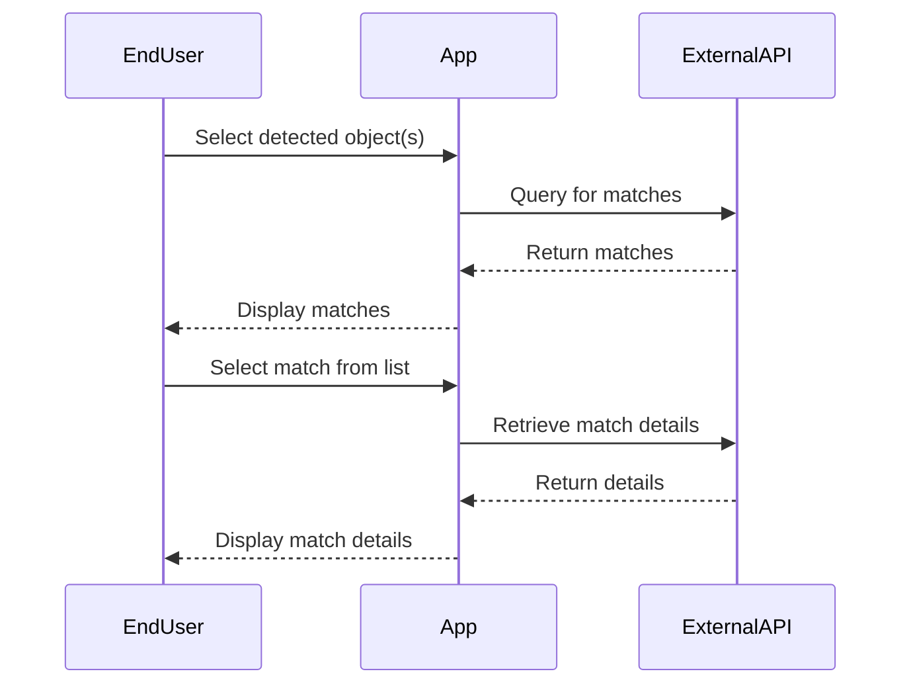
```mermaid
sequenceDiagram
    participant EndUser
    participant App
    participant ExternalAPI

    EndUser->>App: Select detected object(s)
    App->>ExternalAPI: Query for matches
    ExternalAPI-->>App: Return matches
    App-->>EndUser: Display matches
    EndUser->>App: Select match from list
    App->>ExternalAPI: Retrieve match details
    ExternalAPI-->>App: Return details
    App-->>EndUser: Display match details
```

### **3.1.4 View Details for Selected Match**
- **Goal in Context**: The user wants to view detailed information about a selected match.
- **Actors**: End User, External API
- **Preconditions**: A match has been selected from the matches list.
- **Scenario Steps**:
  1. The user selects a match from the list.
  2. The app retrieves detailed metadata from the external API or local database.
  3. The app displays the details, including images, descriptions, and related content.

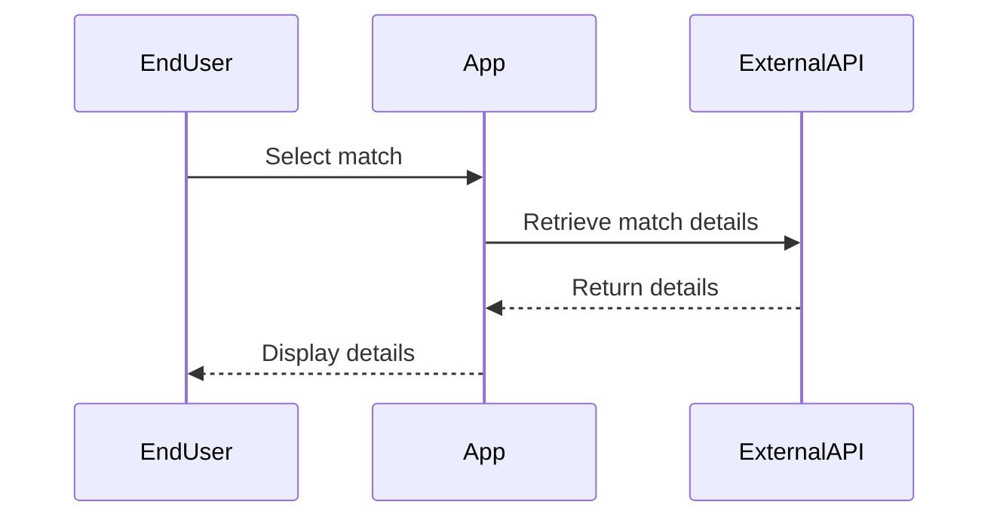
```mermaid
sequenceDiagram
    participant EndUser
    participant App
    participant ExternalAPI

    EndUser->>App: Select match
    App->>ExternalAPI: Retrieve match details
    ExternalAPI-->>App: Return details
    App-->>EndUser: Display details
```

### **3.1.5 View and Manage History**
- **Goal in Context**: The user wants to review, sort, filter, view details, or delete previous classification results.
- **Actors**: End User, Store, External API
- **Preconditions**: The app has stored classification history.
- **Scenario Steps**:
  1. The user navigates to the history view.
  2. The app displays a list of past classification results from the store.
  3. The user sorts history by name or date.
  4. The user applies filters to the history list.
  5. The user selects an item to view details (details are retrieved via API).
  6. The user deletes items from history.
  7. The app updates the history accordingly.

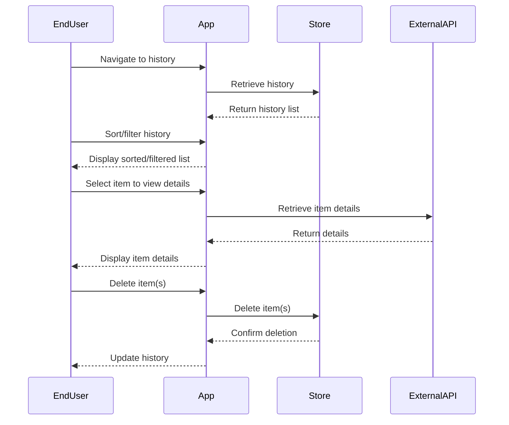
```mermaid
sequenceDiagram
    participant EndUser
    participant App
    participant Store
    participant ExternalAPI

    EndUser->>App: Navigate to history
    App->>Store: Retrieve history
    Store-->>App: Return history list
    EndUser->>App: Sort/filter history
    App-->>EndUser: Display sorted/filtered list
    EndUser->>App: Select item to view details
    App->>ExternalAPI: Retrieve item details
    ExternalAPI-->>App: Return details
    App-->>EndUser: Display item details
    EndUser->>App: Delete item(s)
    App->>Store: Delete item(s)
    Store-->>App: Confirm deletion
    App-->>EndUser: Update history
```

### **3.1.6 Manage Models (via Settings)**
- **Goal in Context**: The user or developer wants to install, update, configure, select, or remove classification models through the Settings interface.
- **Actors**: End User, Developer, Model Manager
- **Preconditions**: The app supports model management in Settings and has access to model sources (local/cloud).
- **Scenario Steps**:
  1. The user/developer opens the Settings interface.
  2. The user adds a new ONNX model from local or cloud storage.
  3. The app validates the model and returns input/output shape and file size.
  4. The user edits display name, description, confidence threshold, and IOU threshold.
  5. The user selects a model from the list of previously added models.
  6. The user updates or deletes models from the list.
  7. The app validates and applies model changes.

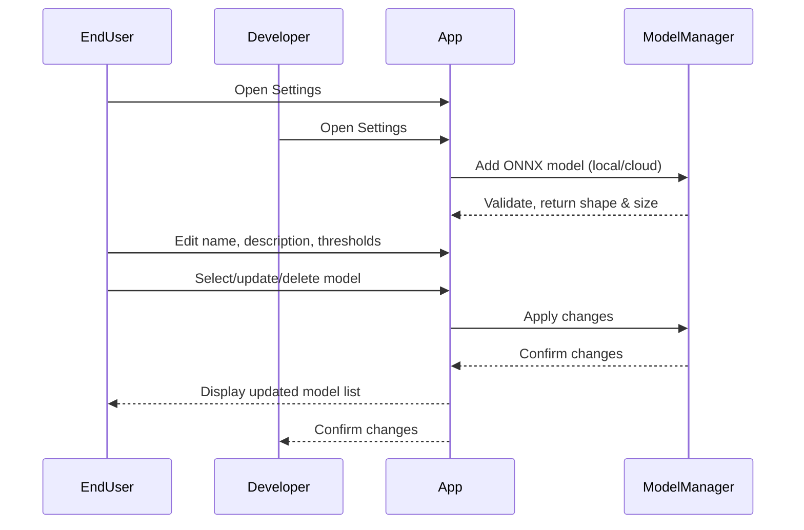
```mermaid
sequenceDiagram
    participant EndUser
    participant Developer
    participant App
    participant ModelManager

    EndUser->>App: Open Settings
    Developer->>App: Open Settings
    App->>ModelManager: Add ONNX model (local/cloud)
    ModelManager-->>App: Validate, return shape & size
    EndUser->>App: Edit name, description, thresholds
    EndUser->>App: Select/update/delete model
    App->>ModelManager: Apply changes
    ModelManager-->>App: Confirm changes
    App-->>EndUser: Display updated model list
    App-->>Developer: Confirm changes
```

### **3.1.7 Switch Classification Model (via Settings)**
- **Goal in Context**: The user switches between available classification models from the Settings screen.
- **Actors**: End User, Model Manager
- **Preconditions**: Multiple models are installed and available in Settings.
- **Scenario Steps**:
  1. The user opens the Settings interface.
  2. The user selects a different model from the list.
  3. The app initiates a new ONNX Runtime session with the selected model.
  4. The app retrieves and displays the model's input/output shape.

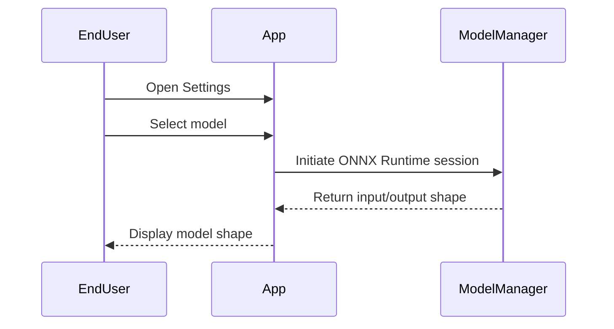
```mermaid
sequenceDiagram
    participant EndUser
    participant App
    participant ModelManager

    EndUser->>App: Open Settings
    EndUser->>App: Select model
    App->>ModelManager: Initiate ONNX Runtime session
    ModelManager-->>App: Return input/output shape
    App-->>EndUser: Display model shape
```

### **3.1.8 Integrate with External Apps**
- **Goal in Context**: The app supports integration with external APIs to retrieve matches and detailed information for classified objects.
- **Actors**: End User, External API
- **Preconditions**: Integration settings are configured and supported APIs are available.
- **Scenario Steps**:
  1. The app calls the external API for matches, providing one or more class labels as input.
  2. The API returns a list of matched items, each containing a thumbnail image, name, optional description, categories, and other metadata.
  3. The user selects a matched item.
  4. The app calls the external API for details, providing the matched item's ID.
  5. The API returns detailed information, such as instruction steps, a list of ingredients, links to videos (e.g., YouTube), and additional metadata for filtering.

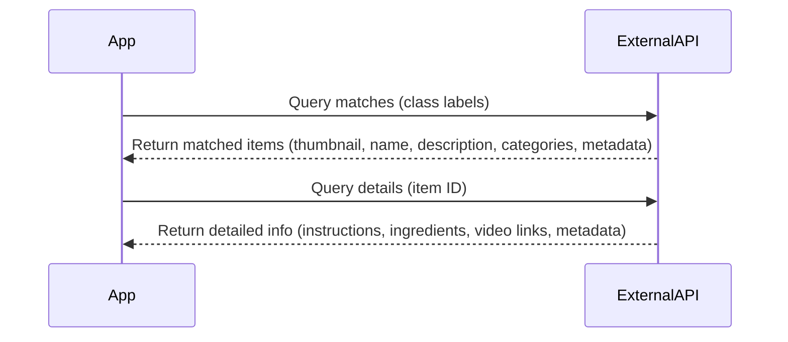
```mermaid
sequenceDiagram
    participant App
    participant ExternalAPI

    App->>ExternalAPI: Query matches (class labels)
    ExternalAPI-->>App: Return matched items (thumbnail, name, description, categories, metadata)
    App->>ExternalAPI: Query details (item ID)
    ExternalAPI-->>App: Return detailed info (instructions, ingredients, video links, metadata)
```

### **3.1.9 Sync with Cloud Storage**
- **Goal in Context**: The user wants to load or save models and photos from cloud storage services such as iCloud or Google Drive.
- **Actors**: End User, Cloud Storage
- **Preconditions**: The app has the necessary permissions and access to open folders in cloud drives on the phone or laptop.
- **Scenario Steps**:
  1. The user initiates a load or save operation for a model or photo.
  2. The app requests access to the relevant cloud storage service (iCloud, Google Drive).
  3. The user browses and selects a folder or file in the cloud drive.
  4. The app loads the selected file into the app or saves the file to the chosen location.
  5. The app confirms completion and updates the local or cloud state.

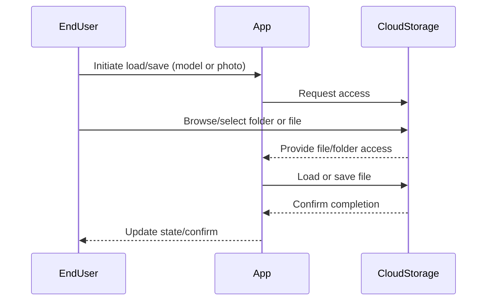
```mermaid
sequenceDiagram
    participant EndUser
    participant App
    participant CloudStorage

    EndUser->>App: Initiate load/save (model or photo)
    App->>CloudStorage: Request access
    EndUser->>CloudStorage: Browse/select folder or file
    CloudStorage-->>App: Provide file/folder access
    App->>CloudStorage: Load or save file
    CloudStorage-->>App: Confirm completion
    App-->>EndUser: Update state/confirm
```

### **3.1.10 Export or Copy Results**
- **Goal in Context**: The user wants to export or copy to clipboard inference results, matches, or detailed information for sharing or analysis.
- **Actors**: End User
- **Preconditions**: Results (inference, matches, or details) are available.
- **Scenario Steps**:
  1. The user clicks an export or copy button.
  2. If exporting, the app shows a dialog for the user to enter a filename and select a destination folder.
  3. The app generates and saves the selected content.
  4. If copying to clipboard, the app copies the content and shows an alert (which can be disabled in settings) confirming the copy was successful.

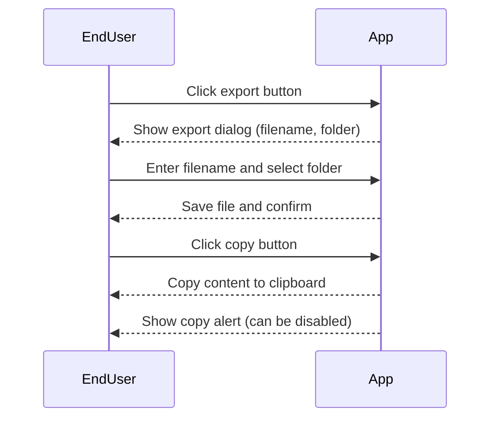
```mermaid
sequenceDiagram
    participant EndUser
    participant App

    %% Export sequence
    EndUser->>App: Click export button
    App-->>EndUser: Show export dialog (filename, folder)
    EndUser->>App: Enter filename and select folder
    App-->>EndUser: Save file and confirm

    %% Copy to clipboard sequence
    EndUser->>App: Click copy button
    App-->>EndUser: Copy content to clipboard
    App-->>EndUser: Show copy alert (can be disabled)
```

### **3.1.11 Search and Filter History**
- **Goal in Context**: The user wants to find and manage past classifications by searching and sorting history items.
- **Actors**: End User, Results Database
- **Preconditions**: Classification history is available and indexed.
- **Scenario Steps**:
  1. The user opens the history interface.
  2. The app displays a list of previously selected items with details.
  3. The user enters text in the filter box; the app filters the list to show items whose name contains the entered text.
  4. The user sorts the filtered list by name or date, in ascending or descending order.
  5. The user reviews or manages the filtered and sorted results.

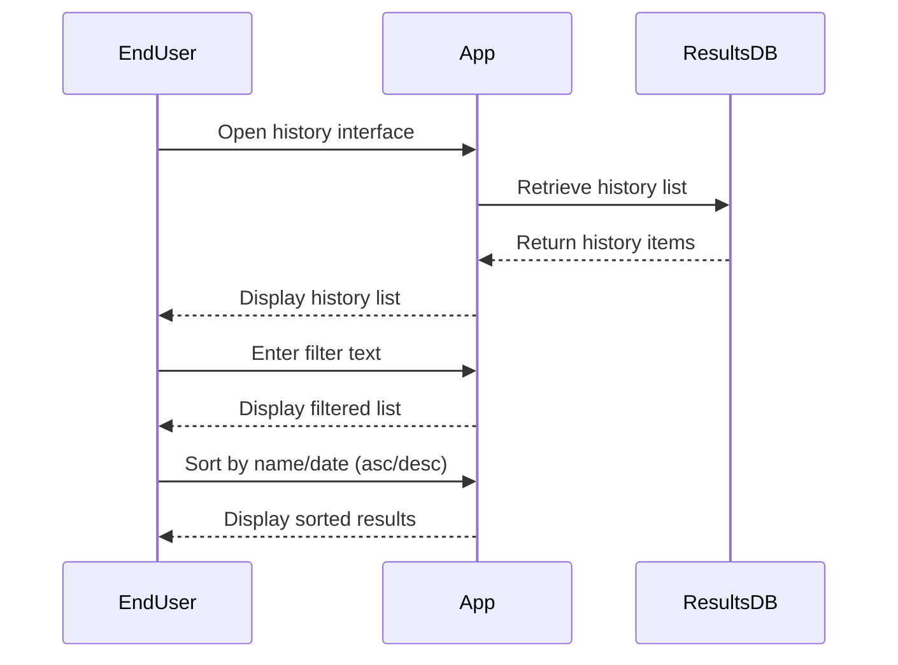
```mermaid
sequenceDiagram
    participant EndUser
    participant App
    participant ResultsDB

    EndUser->>App: Open history interface
    App->>ResultsDB: Retrieve history list
    ResultsDB-->>App: Return history items
    App-->>EndUser: Display history list
    EndUser->>App: Enter filter text
    App-->>EndUser: Display filtered list
    EndUser->>App: Sort by name/date (asc/desc)
    App-->>EndUser: Display sorted results
```

### **3.1.12 Configure App Settings**
- **Goal in Context**: The user wants to configure preferences such as default model, UI settings, and thresholds.
- **Actors**: End User
- **Preconditions**: The app provides a settings interface.
- **Scenario Steps**:
  1. The user opens the settings menu.
  2. The user adjusts preferences (e.g., theme, default model, confidence threshold).
  3. The app saves and applies the new settings.

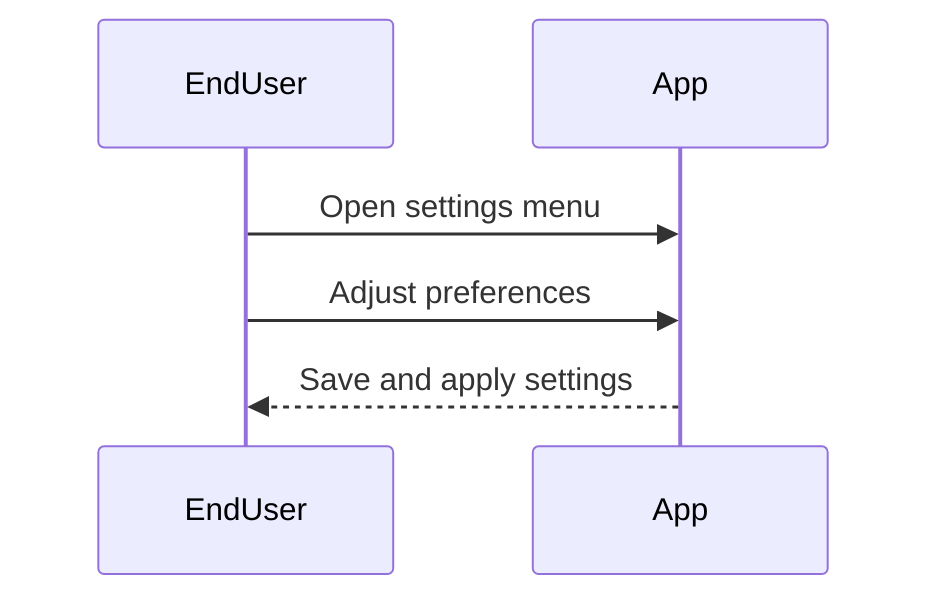
```mermaid
sequenceDiagram
    participant EndUser
    participant App

    EndUser->>App: Open settings menu
    EndUser->>App: Adjust preferences
    App-->>EndUser: Save and apply settings
```

### **3.1.13 View and Manage Favorites**
- **Goal in Context**: The user wants to view, add, remove, filter, or sort items in their favorites list.
- **Actors**: End User
- **Preconditions**: The app supports favorites management.
- **Scenario Steps**:
  1. The user adds an item to favorites from the details view.
  2. The user navigates to the favorites view.
  3. The app displays the list of favorite items.
  4. The user deletes items from the favorites list.
  5. The user filters favorites by entering text; the app shows items whose name contains the text.
  6. The user sorts favorites by name or date, in ascending or descending order.
  7. The app updates the favorites accordingly.

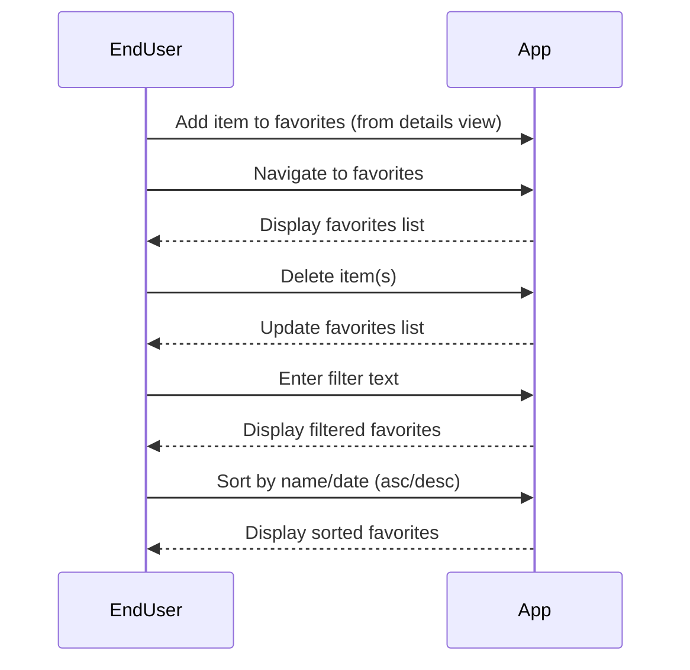
```mermaid
sequenceDiagram
    participant EndUser
    participant App

    EndUser->>App: Add item to favorites (from details view)
    EndUser->>App: Navigate to favorites
    App-->>EndUser: Display favorites list
    EndUser->>App: Delete item(s)
    App-->>EndUser: Update favorites list
    EndUser->>App: Enter filter text
    App-->>EndUser: Display filtered favorites
    EndUser->>App: Sort by name/date (asc/desc)
    App-->>EndUser: Display sorted favorites
```

### **3.1.14 Handle Invalid Models or Images**
- **Goal in Context**: The user wants the app to detect and handle errors related to invalid, unsupported, or duplicate models when adding from the Settings screen.
- **Actors**: End User, Model Manager
- **Preconditions**: The user is trying to add a model from the Settings screen.
- **Scenario Steps**:
  1. The user attempts to add a new ONNX model from the Settings screen.
  2. The app checks for duplicate models and does not allow duplicates.
  3. The app validates that the model is an ONNX model in YOLO format (input shape 1,3,640,640) and includes label names in its metadata.
  4. If the model is invalid or duplicate, the app displays an error message and does not add the model.
  5. If the model is valid, the app adds it to the model list and automatically selects it.

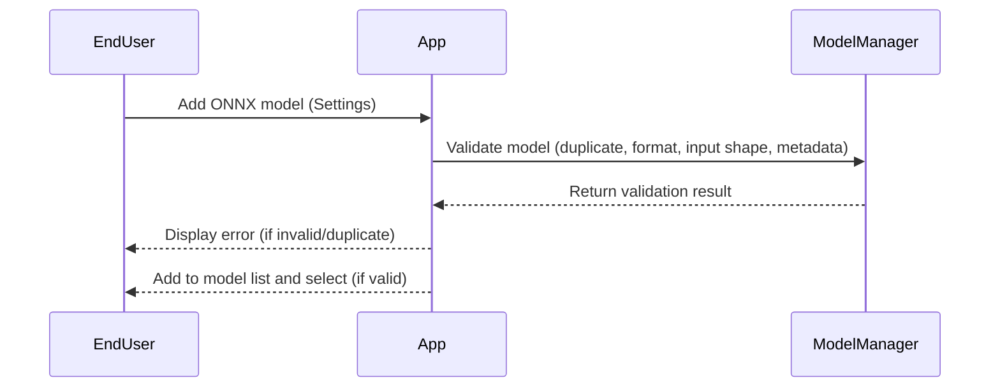
```mermaid
sequenceDiagram
    participant EndUser
    participant App
    participant ModelManager

    EndUser->>App: Add ONNX model (Settings)
    App->>ModelManager: Validate model (duplicate, format, input shape, metadata)
    ModelManager-->>App: Return validation result
    App-->>EndUser: Display error (if invalid/duplicate)
    App-->>EndUser: Add to model list and select (if valid)
```

