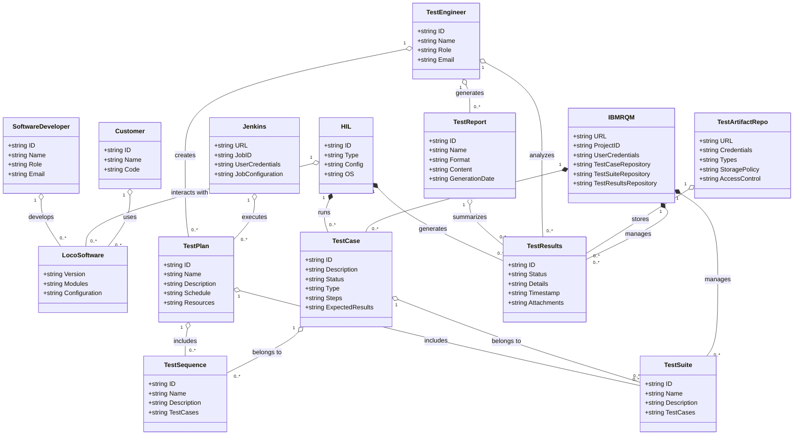
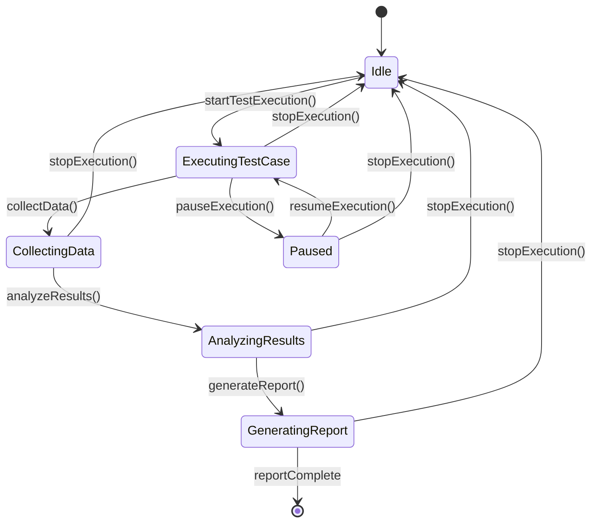

## 3.3 Initial Domain Model - Class Diagram
Depicted below is the initial domain model based on pruned classes.

Here is a high level state machine for the test automation framework / use cases...

