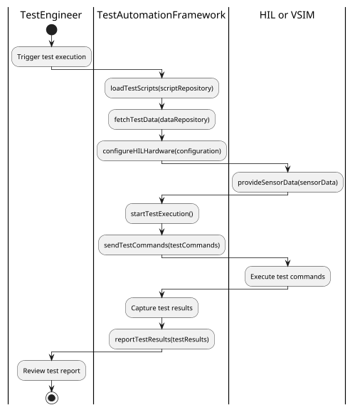

## 3.5 Activity Diagram
Listed below is the high level activity diagram for the Execute Test Plan, Suite, or Case use case.

```puml
@startuml
scale 500 width
|TestEngineer|
start
:Trigger test execution;

|TestAutomationFramework|
:loadTestScripts(scriptRepository);
:fetchTestData(dataRepository);
:configureHILHardware(configuration);

|HIL or VSIM|
:provideSensorData(sensorData);

|TestAutomationFramework|
:startTestExecution();
:sendTestCommands(testCommands);

|HIL or VSIM|
:Execute test commands;

|TestAutomationFramework|
:Capture test results;
:reportTestResults(testResults);

|TestEngineer|
:Review test report;

stop
@enduml
```

