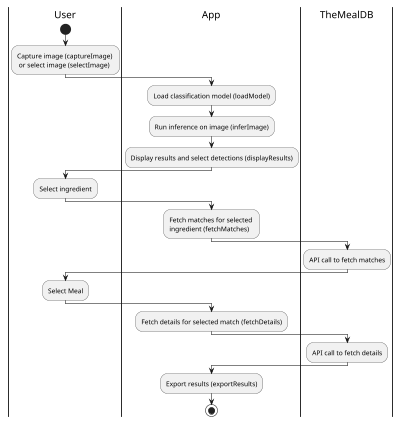

## 3.5 Activity Diagram
Listed below is the high level activity diagram for the Classifi-Cam image classification workflow, based on the primary input operations.

```puml
@startuml
scale 0.55
|User|
start
:Capture image (captureImage) \n or select image (selectImage);

|App|
:Load classification model (loadModel);

:Run inference on image (inferImage);

:Display results and select detections (displayResults);

|User|
:Select ingredient;

|App|
:Fetch matches for selected \ningredient (fetchMatches);

|TheMealDB|
:API call to fetch matches;

|User|
:Select Meal;

|App|
:Fetch details for selected match (fetchDetails);

|TheMealDB|
:API call to fetch details;

|App|
:Export results (exportResults);

stop
@enduml
```

