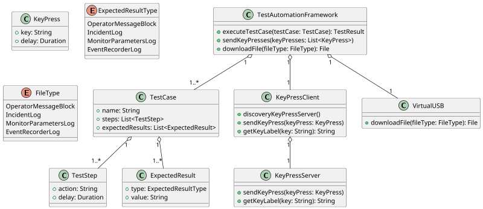

## 3.6 Select Diagrams

### 3.6.1 Class Diagram
Below is an example class diagram for the KeyPress service with SDIS

### 3.6.2 Component and Connector
The following component and connector diagram is for the keypress, screen capture, and file download functionality of SDIS.  It also illustrates the layered approach to Test Cases using Features that relay on Devices and implemented services.

@import "../images/candc.svg"

