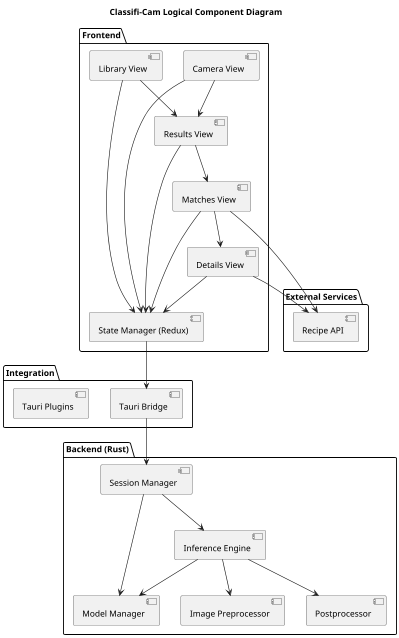
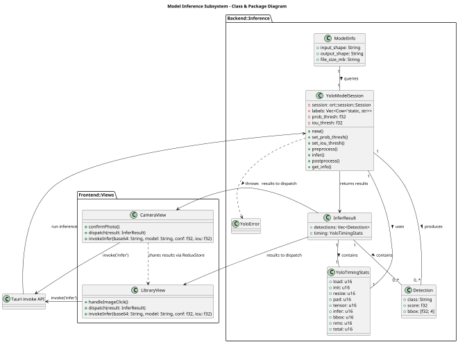
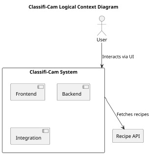

## 5.1 Logical View

### 5.1.1 Description
This view conforms to the Logical Viewpoint described in Section 4.1. It presents the high-level structure and organization of the Classifi-Cam system, focusing on the major software components, their responsibilities, and the interfaces and interactions between them. The logical view provides the foundation for understanding how the system fulfills its functional requirements and supports integration with other architectural viewpoints.

### 5.1.2 Primary Presentation
The following UML component diagram illustrates the main logical components of the Classifi-Cam system and their relationships.  
A detailed class and package diagram for the model inference subsystem is provided in Section 5.1.2.2.

---

### 5.1.2.2 Class and Package Diagram: Model Inference Subsystem

The diagram below focuses on the key classes and their relationships involved in the model inference pipeline.

### 5.1.3 Context Diagram
The context diagram below shows how the Classifi-Cam system interacts with users and external services.

### 5.1.4 Element Catalog

#### 5.1.4.1 Elements

| Component                | Description                                                                                   | Responsibility                                              |
|--------------------------|-----------------------------------------------------------------------------------------------|-------------------------------------------------------------|
| Camera View              | UI for capturing images                                                                      | Initiate image capture and send to backend                  |
| Library View             | UI for selecting images from device storage                                                   | Select image and send to backend                            |
| Results View             | UI for displaying detected objects and bounding boxes                                         | Show inference results, allow object selection              |
| Matches View             | UI for displaying recipes related to selected objects                                         | Fetch and show related recipes                              |
| Details View             | UI for presenting full recipe information                                                     | Display recipe details and instructions                     |
| State Manager (Redux)    | Application state management                                                                 | Manage view state, inference results, selections, favorites |
| Tauri Bridge             | IPC between frontend and backend                                                             | Invoke backend commands, transfer data                      |
| Tauri Plugins            | Platform integration (dialog, fs, window, etc.)                                              | Access OS features                                          |
| Session Manager          | Backend session lifecycle management                                                         | Manage model sessions, resources                            |
| Model Manager            | Handles model loading, selection, and configuration                                          | Manage available models and settings                        |
| Inference Engine         | Executes ONNX model inference                                                                | Run AI inference on images                                  |
| Image Preprocessor       | Prepares images for inference                                                                | Resize, pad, convert to tensor                              |
| Postprocessor            | Processes inference results                                                                  | NMS, bounding box extraction, label mapping                 |
| Recipe API               | External recipe database                                                                     | Provide recipe data                                         |

#### 5.1.4.2 Relations

| Relation Type   | Description                                                                                           |
|-----------------|-------------------------------------------------------------------------------------------------------|
| Dependency      | UI components depend on state manager for data and navigation                                         |
| Invocation      | Frontend invokes backend commands via Tauri bridge                                                    |
| Data Exchange   | Backend returns inference results to frontend                                                         |
| API Call        | Matches View and Details View call Recipe API for recipes                                             |
| Containment     | Session Manager contains model and inference engine                                                   |

#### 5.1.4.3 Interfaces

| Interface           | Description                                                                                   |
|---------------------|-----------------------------------------------------------------------------------------------|
| Tauri invoke API    | Frontend-to-backend communication for inference, session, and model management                |
| Redux Store         | State management interface for UI components                                                  |
| Tauri Plugins       | Dialog, fs, window, notification, etc.                                                        |
| Recipe API          | RESTful interface for recipe queries                                                          |

#### 5.1.4.4 Behavior

| Behavior                        | Description                                                                                   |
|----------------------------------|-----------------------------------------------------------------------------------------------|
| Image Capture/Selection         | User captures or selects image; frontend sends to backend for inference                       |
| Inference Pipeline              | Backend preprocesses image, runs inference, postprocesses results, returns detections         |
| Result Exploration              | Frontend displays results; user selects object; frontend fetches recipes from Recipe API       |
| State Update                    | Redux store updates state after backend or API response; triggers UI re-render                |
| Manual View Selection           | User manually selects a view; updates `view.selected` in state; triggers UI re-render         |
| Error Handling                  | Backend and frontend handle errors (invalid image, API failure, invalid/duplicate model) and display feedback |
| Startup/Shutdown                | System initializes model sessions and resources on startup; releases resources on shutdown    |

#### 5.1.4.5 Constraints

- All image processing and inference is performed locally for privacy and offline support.
- Only minimal, non-sensitive data is sent to external APIs.
- Components must be modular and extensible for new models, plugins, and features.
- UI must be responsive and accessible across platforms.
- Logical flows must support concurrency and robust error handling.

### 5.1.5 Architecture Background

The logical architecture of Classifi-Cam is designed to support maintainability, extensibility, performance, and privacy. The system is organized into modular frontend, backend, and integration components, with clear separation of concerns and well-defined interfaces. The use of Redux for state management, Tauri for frontend-backend integration, and Rust for backend AI processing ensures a robust, scalable, and cross-platform solution. All sensitive processing is performed locally, and only minimal data is exchanged with external services, supporting privacy and compliance requirements. The architecture is validated through peer review, walkthroughs, and testing, ensuring it meets the desired quality attributes and functional requirements.
