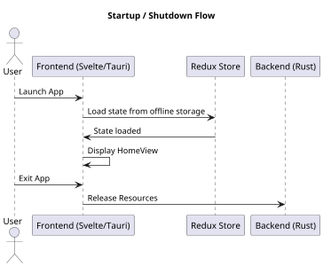
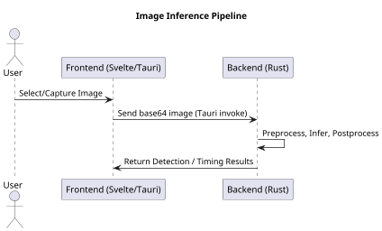
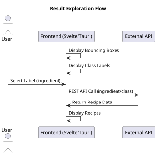
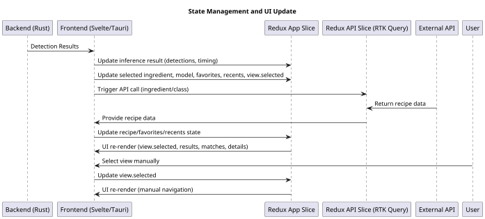
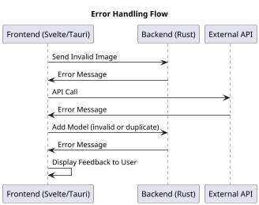
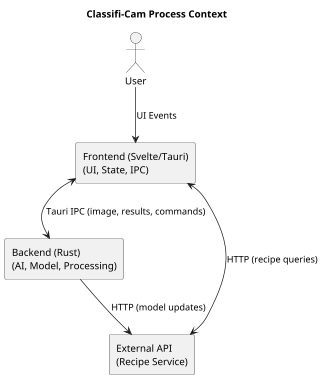

## 5.2 Process View

### 5.2.1 Description
This view conforms to the Process Viewpoint described in Section 4.2. It describes the dynamic aspects of the Classifi-Cam system, including concurrency, distribution, and system operations. The process view focuses on the flow of data and control between major processes and threads, the mechanisms for inter-process communication, and the orchestration of image classification, result exploration, state management, error handling, and external API integration. This view is essential for analyzing performance, reliability, and scalability.

### 5.2.2 Primary Presentation
The following diagrams illustrate the five primary process flows in the Classifi-Cam system.

#### 1. Startup/Shutdown

#### 2. Image Inference Pipeline

#### 3. Result Exploration

#### 4. State Management and UI Update

**State Management Details**

| Slice         | Key State Fields                                                                                  | Responsibilities                                                                                 |
|---------------|--------------------------------------------------------------------------------------------------|--------------------------------------------------------------------------------------------------|
| App Slice     | `view.selected`, `results`, `ingredient`, `model`, `favorites`, `recents`, `recipe`, `timing`    | Holds current view, inference results, selected ingredient/model, favorites, recents, recipe, timing |
| API Slice     | RTK Query cache (meals, recipes, etc.)                                                           | Manages API call results and caching for recipe/meal data                                        |

- The **App Slice** manages UI navigation, inference results, user selections, favorites, and recents, and persists state to offline storage.
- The **API Slice** (RTK Query) manages the results of external API calls and caches recipe/meal data for efficient access.
- UI components re-render automatically when relevant state in either slice changes.
- **User can manually select a view**, which updates `view.selected` in the app slice and causes the frontend to rerender the appropriate screen.

#### 5. Error Handling

### 5.2.3 Context Diagram

The following diagram shows the high-level process context for Classifi-Cam, including the user, frontend, backend, and external API interactions.

### 5.2.4 Element Catalog

#### 5.2.4.1 Elements

| Process/Thread            | Description                                                                                  | Responsibilities                                      |
|---------------------------|----------------------------------------------------------------------------------------------|-------------------------------------------------------|
| Frontend Main Thread      | Svelte/Tauri UI process                                                                      | Handles user events, view rendering, state management |
| Redux Store Thread        | State management (may be part of main thread)                                                | Manages app and API state                             |
| Tauri Bridge Thread       | IPC between frontend and backend                                                             | Invokes backend commands, receives results            |
| Rust Backend Thread       | Rust process running YOLO model session                                                      | Preprocesses image, runs inference, postprocesses     |
| External API Thread       | HTTP client for recipe API                                                                   | Fetches recipe data                                   |

#### 5.2.4.2 Relations

| Relation Type         | Description                                                                                      |
|-----------------------|--------------------------------------------------------------------------------------------------|
| UI Event              | User interacts with frontend views, triggering state changes and backend invocations              |
| IPC                   | Frontend communicates with backend via Tauri invoke API                                          |
| Data Exchange         | Backend returns detection results to frontend                                                    |
| API Call              | Frontend calls external recipe API and receives data                                             |
| Thread Synchronization| Redux store ensures consistent state across UI components                                        |

#### 5.2.4.3 Interfaces

| Interface           | Description                                                                                   |
|---------------------|-----------------------------------------------------------------------------------------------|
| Tauri invoke API    | IPC for frontend-backend communication (image inference, info, etc.)                         |
| Redux Store         | State management interface for UI components                                                  |
| REST API            | HTTP interface for recipe queries                                                             |

#### 5.2.4.4 Behavior

The following table summarizes the significant behaviors and control flows:

| Behavior                        | Description                                                                                   |
|----------------------------------|-----------------------------------------------------------------------------------------------|
| Image Inference Pipeline         | Frontend sends base64 image to backend; backend preprocesses, infers, postprocesses, returns results |
| Result Exploration               | Frontend displays bounding boxes; user selects object; frontend calls API for recipes         |
| State Update                     | Redux store updates state after backend or API response; triggers UI re-render                |
| Manual View Selection            | User manually selects a view; updates `view.selected` in state; triggers UI re-render         |
| Error Handling                   | Backend and frontend handle errors (invalid image, API failure) and display feedback          |
| Startup/Shutdown                 | Processes initialize model sessions and resources on startup; release resources on shutdown   |

#### 5.2.4.5 Constraints

- Inference and UI updates must be fast and responsive.
- All image processing and inference is performed locally for privacy and offline support.
- Only minimal, non-sensitive data is sent to external APIs.
- Processes must be robust to errors and failures (e.g., invalid images, API downtime).
- System must support concurrency for UI responsiveness and backend processing.
- Must operate across iOS, Android, macOS, Windows, and Linux platforms.

### 5.2.5 Architecture Background

The process architecture of Classifi-Cam is designed for performance, privacy, and extensibility. The frontend and backend run as separate processes/threads, communicating via Tauri IPC. The backend leverages Rust and ONNX Runtime for efficient AI inference, while the frontend uses Svelte and Redux for responsive UI and state management. External APIs are accessed via HTTP, with all sensitive processing performed locally. The architecture supports hardware acceleration, modularity, and robust error handling, ensuring a high-quality user experience across platforms.
