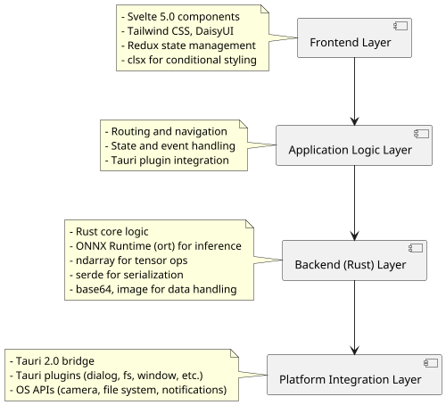
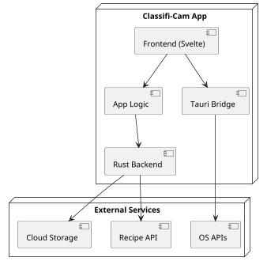
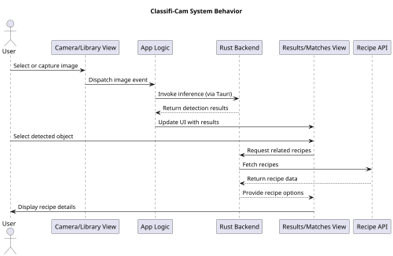

## 5.3 Development View

### 5.3.1 Description
This view conforms to the Development Viewpoint described in Section 4.3. It presents the architecture of the Classifi-Cam system using a layered style, depicting how source code elements are organized into logical layers and modules.

The Classifi-Cam codebase is structured as a cross-platform desktop and mobile application, with a Svelte-based frontend, a Rust backend, and Tauri as the bridge between them. The layered organization supports separation of concerns for maintainability, independent development, testing, and evolution of the system over time.

### 5.3.2 Primary Presentation
The diagram below shows the primary layers and modules of the Classifi-Cam system.

### 5.3.3 Context Diagram
Here is the context diagram of the Classifi-Cam system with relation to external systems and services.

### 5.3.4 Element Catalog

#### 5.3.4.1 Elements
The following table lists the key source code modules and responsibilities in the Classifi-Cam layers.

| Layer                      | Module/Package              | Responsibilities                                                                                      |
|----------------------------|-----------------------------|-------------------------------------------------------------------------------------------------------|
| Frontend Layer             | `src/components/`           | Svelte UI components for Camera, Library, Results, Matches, Details                                   |
|                            | `src/views/`                | Svelte view modules for main application screens                                                      |
|                            | `src/layouts/`              | Layout components for consistent page structure and navigation (titlebar, view container, statusbar)  |
|                            | `src/constants/`            | Shared constants and configuration values for frontend                                                |
|                            | `src/styles/`               | Tailwind CSS and DaisyUI for styling                                                                  |
|                            | `src/utils/clsx.ts`         | Conditional class name utility                                                                        |
| Application Logic Layer    | `src/store/`                | Redux store for global state management, including App and API slices                                 |
| Backend (Rust) Layer       | `src-tauri/src/model.rs`    | Implements YOLO model session management, ONNX inference, image preprocessing (resize, pad, tensor conversion), postprocessing (NMS, bounding box extraction), and label handling. |
|                            | `src-tauri/src/lib.rs`      | Provides Tauri command handlers (`infer`, `info`), manages model session lifecycle, integrates with Tauri plugins, handles base64 image decoding, resource path resolution, and exposes Rust logic to the frontend. |
| Platform Integration Layer | `src-tauri/tauri.conf.json` | Tauri configuration and plugin setup                                                                  |
|                            | Tauri Plugins               | Dialog, fs, window, notification, etc.                                                                |

#### 5.3.4.2 Relations
This table lists the relations and interactions among elements in the Classifi-Cam system.

| Relation Type | Description                                                                                                    |
|---------------|----------------------------------------------------------------------------------------------------------------|
| Dependency    | Frontend depends on Application Logic for state and event handling; Backend depends on Rust crates for AI ops. |
| Invocation    | Frontend invokes backend functions via Tauri bridge and plugins.                                               |
| Association   | Application Logic coordinates between UI, plugins, and backend.                                                |
| Restriction   | Platform Integration Layer modules interact with OS APIs only via Tauri plugins.                               |

#### 5.3.4.3 Interfaces
This table lists the software interfaces that must be visible to other elements.

| Interface           | Description                                                                                   |
|---------------------|-----------------------------------------------------------------------------------------------|
| Tauri invoke API    | Frontend-to-backend communication for image inference and system operations                   |
| Redux Store         | State management interface for Svelte components                                              |
| Tauri Plugins       | Dialog, fs, window, notification, etc.                                                        |
| Rust API Endpoints  | Functions exposed to frontend for inference, data handling, and external API calls            |

#### 5.3.4.4 Behavior

The overall behavior of the Classifi-Cam system can be summarized as follows:

#### 5.3.4.5 Constraints
This section describes any additional constraints on elements or relations not otherwise described.

- The system must support cross-platform deployment (iOS, Android, macOS, Windows, Linux).
- All image processing and inference must be performed locally for privacy and offline support.
- Only minimal, non-sensitive data is sent to external APIs.
- The codebase must be modular and extensible for new models, plugins, and features.
- UI must be responsive and accessible, leveraging Tailwind and DaisyUI.
- Build tools and configuration must support rapid development and reliable packaging.

### 5.3.5 Architecture Background

The development view of Classifi-Cam is designed to address key architectural drivers: maintainability, extensibility, performance, and privacy.

**Build Tools:**  
- **vite**: Fast frontend development and hot module replacement for Svelte.
- **cargo**: Rust package manager and build tool for backend logic.
- **tauri-cli**: Builds, bundles, and manages the Tauri application.
- **uv**: Python virtual environment and dependency manager (used for plugin or scripting support).

**Key Frameworks and Libraries:**  
- **Svelte 5.0**: Modern, reactive UI framework for building frontend components.
- **Tailwind CSS & DaisyUI**: Utility-first CSS and UI component library for rapid, consistent styling.
- **Tauri 2.0**: Secure, lightweight bridge between frontend and backend, enabling cross-platform desktop and mobile apps.

**Key Dependencies:**  
- **Frontend:**  
  - **tauri plugins**: Dialog, fs, window, notification, etc. for platform integration.
  - **redux**: State management for predictable UI updates.
  - **clsx**: Utility for conditional class names in Svelte components.
- **Backend (Rust):**  
  - **ort**: ONNX Runtime for fast, hardware-accelerated AI inference.
  - **ndarray**: Efficient tensor and matrix operations.
  - **serde**: Serialization/deserialization for data exchange.
  - **base64**: Encoding/decoding image data.
  - **image**: Image processing utilities.

The layered, modular architecture enables independent development and testing of UI, business logic, and backend AI components. Tauri plugins and configuration abstract away platform-specific details, while the use of modern build tools ensures fast iteration and reliable deployment. The system is designed for privacy, extensibility, and high performance, meeting the needs of users