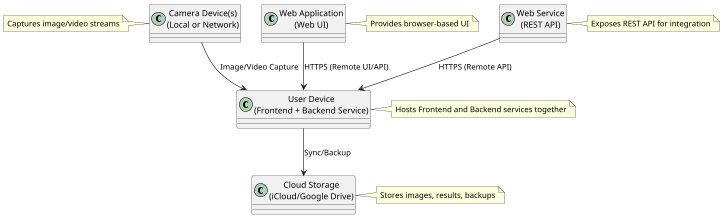
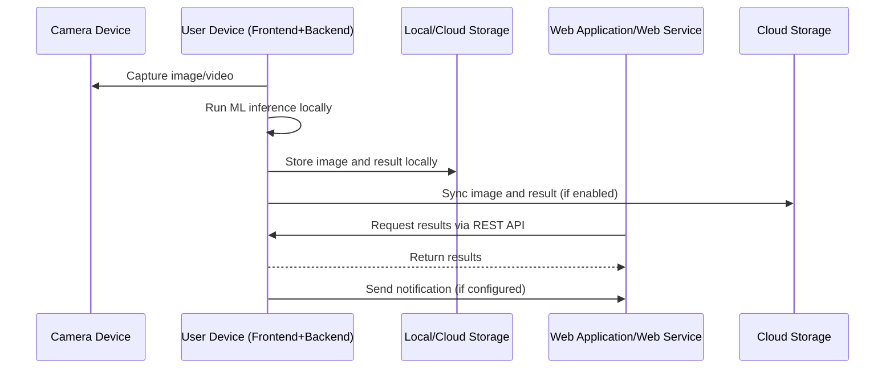

## 5.4 Physical View

### 5.4.1 Description
This view conforms to the Physical Viewpoint as described in Section 3.4. There is one view packet in this section, presented as a deployment diagram. It shows how Classific-cam software system elements are distributed across the target execution environment. The allocated-to relationships indicate which physical units host which software elements. This view supports analysis of performance, reliability, scalability, and security, and can inform hardware/cloud resource planning.

### 5.4.2 Primary Presentation
The deployment diagram below shows all major hardware and software elements for the Classific-cam system.

@import "../../images/arch.svg"

> **Note:** In typical deployments, both the Frontend Service and Backend Service are packaged together and run as a single application on the user’s device (mobile phone or computer), providing an integrated experience for local inference and user interaction.

### 5.4.3 Context Diagram
Below is a context diagram showing the Classific-cam services and their interactions with other physical elements in the system. The application can run locally on a mobile phone or computer, or remotely on a server/cloud VM, and exposes APIs for client applications.

### 5.4.4 Element Catalog

#### 5.4.4.1 Elements
The following table lists hardware and software elements and their responsibilities in the Classific-cam deployment.

| Element             | Description                              | Responsibility                                  |
| ------------------- | ---------------------------------------- | ----------------------------------------------- |
| Frontend Service    | Svelte/Typescript app (local or web)     | User interface, image capture, display results  |
| Backend Service     | Rust backend (local or remote)           | ML inference, API, business logic               |
| Local Storage       | Store, photo library (device)            | Persist images, results, user data              |
| Cloud Storage       | iCloud, Google Drive                     | Sync and backup images/results                  |
| Web Application     | Hosted web UI                            | Remote access to UI and results                 |
| Web Service         | Hosted REST API                          | Remote API for integration and automation       |

> **Note:** The Frontend Service and Backend Service are packaged together and deployed as a single application to the user’s device (mobile phone or computer). This enables local inference and user interaction without requiring a remote server.

The following table lists key software elements, their execution environments, and responsibilities.

| Software Element      | Execution Environment | Responsibility                                                                               |
| --------------------- | --------------------- | -------------------------------------------------------------------------------------------- |
| Frontend Service      | Client Device/Web     | Capture images, display results, manage settings                                             |
| Backend Service       | Client Device/Server  | Run ML models, process images, expose API                                                    |
| Local Storage         | Device                | Store images, results, history                                                               |
| Cloud Storage         | Cloud                 | Sync images/results, provide remote access                                                   |
| Web Application       | Cloud/Web Host        | Provide browser-based UI                                                                     |
| Web Service           | Cloud/Web Host        | Expose REST API for integration and automation                                               |

#### 5.4.4.2 Relations
This table lists relations among elements, including restrictions.

| Relation Type | Description                                                                                                                                                                                                 |
| ------------- | ---------------------------------------------------------------------------------------------------------------------------------------------------------------------------------------------------------- |
| Co-location   | - Frontend Service and Backend Service are co-located and deployed together as a single application on the user’s device (mobile phone or computer) in local deployments.                                   |
| Communication | - Frontend Service communicates with Backend Service via local API calls. - Backend Service communicates with Local Storage and Cloud Storage for data persistence and sync. - Web Application and Web Service interact remotely via HTTPS.|
| Dependency    | - Frontend Service depends on Backend Service for inference and business logic. - Backend Service depends on Local/Cloud Storage for saving and retrieving images/results.                               |
| Restriction   | - Local deployment restricts data flow to the user’s device unless cloud sync is enabled. - Remote access only via secure API endpoints.                                                                 |
| Association   | - Classification results associated with specific images and user actions.                                                                                           |

#### 5.4.4.3 Interfaces
This table lists software interfaces that must be visible to other elements.

| Interface                  | Description                                                                                                   |
| :------------------------- | :------------------------------------------------------------------------------------------------------------ |
| Local API                  | Internal API calls between Frontend and Backend services on the device.                                       |
| REST API                   | HTTPS endpoints for client applications to interact with Backend Service.                                     |
| WebSocket                  | Real-time notification interface for clients.                                                                 |
| Cloud Storage API          | Interfaces for syncing with iCloud/Google Drive.                                                             |

#### 5.4.4.4 Behavior
Here is the typical startup sequence for the Classific-cam system.

#### 5.4.4.5 Constraints
Additional constraints on elements or relations:

- User device runs supported OS (Android, iOS, Mac, Windows, Linux).
- ML models use TensorFlow, PyTorch, or ONNX format.
- All communications encrypted via TLS 1.3.
- Local deployment does not require internet except for cloud sync or remote access.
- Follow organization coding standards and security policies.
- Integrate with existing monitoring/logging infrastructure.

### 5.4.5 Architecture Background
Key design decisions for Classific-cam physical deployment:

- **Local Integration**: Frontend and Backend services are bundled for local deployment, enabling offline inference and user interaction.
- **Cloud Sync**: Optional integration with iCloud/Google Drive for backup and remote access.
- **API-first Design**: Expose all core functionality via REST API for easy integration with other systems.
- **Secure Storage**: Store all images and results in encrypted storage; support cloud and on-premises options.
- **Notifications**: Implement real-time notifications via WebSocket and email/SMS for critical events.
- **Authentication**: Use OAuth2 for secure access to API and UI.
- **Scalability**: Design for horizontal scaling; support multiple camera streams and concurrent clients.

These decisions ensure Classific-cam can reliably ingest, classify, and serve results from multiple sources, while maintaining security and performance. Future enhancements may include edge deployment, advanced analytics, and tighter integration with