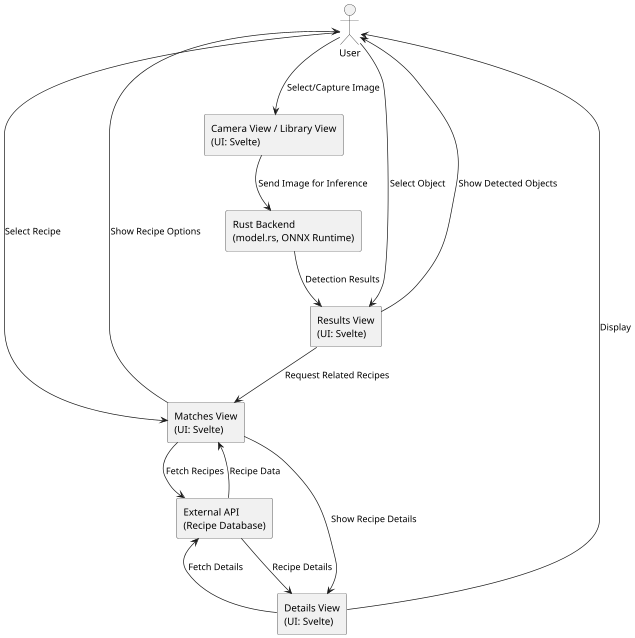
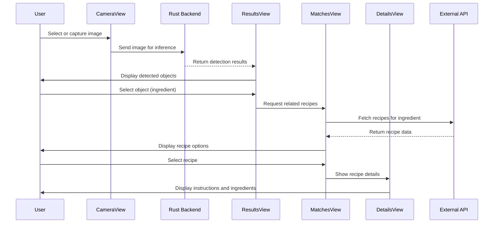

## 5.5 Scenario View

### 5.5.1 Description
This view conforms to the Scenarios Viewpoint as described in Section 4.5. It presents the end-to-end workflow for image classification and result exploration in the Classifi-Cam system. The scenario covers user interactions from image selection or capture, through AI-powered detection, to viewing and exploring results and related content. This view is useful for validating requirements, supporting stakeholder communication, and analyzing system behavior in real-world use.

### 5.5.2 Primary Presentation
The following diagram illustrates the sequence of operations for the image classification and result exploration scenario in Classifi-Cam.

@import "../../images/infer-flow.svg"

### 5.5.3 Context Diagram
Below is a context diagram showing how the scenario interacts with major system components and external services. The workflow integrates frontend views (Camera, Library, Results, Matches, Details) with backend AI inference and external APIs (e.g., recipe database).

### 5.5.4 Element Catalog

#### 5.5.4.1 Elements
The following table lists the key elements and their responsibilities in the image classification scenario.

| Element                | Description                                                                                   | Responsibility                                              |
|------------------------|-----------------------------------------------------------------------------------------------|-------------------------------------------------------------|
| User                   | End user of the application                                                                   | Initiates image selection/capture, interacts with results   |
| Camera View / Library View  | UI components for image input                                                                 | Capture or select images                                    |
| Rust Backend (model.rs)| Backend logic for AI inference and processing (YOLOv11n via ONNX Runtime)                     | Preprocess image, run inference, postprocess results        |
| Results View           | UI component for displaying detected objects and bounding boxes                               | Show detection results, allow object selection              |
| Matches View           | UI component for displaying recipes related to selected objects                               | Fetch and show related recipes                              |
| Details View           | UI component for presenting full recipe information                                           | Display recipe details and instructions                     |
| External API           | Recipe database (e.g., TheMealDB)                                                             | Provide recipe data                                         |

#### 5.5.4.2 Relations
This table lists the relations and interactions among elements in the scenario.

| Relation Type   | Description                                                                                                               |
|-----------------|---------------------------------------------------------------------------------------------------------------------------|
| Interaction     | User interacts with Camera/Library View to provide image input                                                            |
| Invocation      | Frontend invokes backend inference via Tauri API                                                                          |
| Data Exchange   | Backend returns detection results to Results View                                                                         |
| Selection       | User selects detected object; Results View triggers Matches View to fetch related recipes                                 |
| API Call        | Matches View calls External API to retrieve recipes                                                                       |
| Drill-down      | User selects recipe; Details View displays full information                                                               |

#### 5.5.4.3 Interfaces
This table lists the software interfaces that must be visible to other elements.

| Interface           | Description                                                                                   |
|---------------------|-----------------------------------------------------------------------------------------------|
| Tauri invoke API    | Frontend-to-backend communication for image inference                                         |
| External API        | RESTful interface for recipe queries (e.g., TheMealDB)                                        |

#### 5.5.4.4 Behavior
The following sequence diagram describes the typical behavior for the image classification and result exploration scenario.

#### 5.5.4.5 Constraints
This section describes additional constraints on elements or relations not otherwise described.

- Inference must be fast enough for responsive user experience.
- All image processing and inference is performed locally for privacy and offline support.
- Only minimal data (e.g., text) is sent to external APIs; images are not shared externally.
- System must support extensibility for new models and plugins.
- Must operate across iOS, Android, macOS, Windows, and Linux platforms.
- User data and device resources are protected according to privacy requirements.

### 5.5.5 Architecture Background
These are the key design decisions and rationale for the scenario workflow:

- **Rust-based AI Pipeline**: The backend leverages Rust for efficient image preprocessing, model inference, and postprocessing, using ONNX Runtime for hardware acceleration and cross-platform support.
- **Modular Components**: The architecture is modular, allowing easy integration of new AI models and plugins, supporting extensibility and future enhancements.
- **Local Processing**: All inference and image processing is performed on-device, ensuring privacy, offline capability, and user control over data.
- **Frontend-Backend Integration**: The Tauri framework enables seamless communication between Svelte-based frontend views and the Rust backend, supporting a responsive and secure user experience.
- **External API Integration**: Only minimal, non-sensitive data (e.g., ingredient names) is sent to external APIs for recipe lookup, maintaining privacy and compliance.
- **User Experience**: The workflow is designed for speed, clarity, and ease of use, with immediate feedback and intuitive navigation from image selection to result exploration.

These design choices ensure that Classifi-Cam delivers fast, private, and extensible image classification and exploration capabilities, meeting the needs of users and stakeholders.
