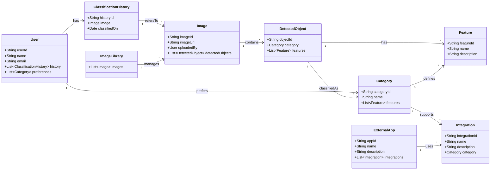

**SOFTWARE ENGINEERING PROGRAM**

**SWENG 894 – CAPSTONE EXPERIENCE**

**CONCEPT OF OPERATIONS AND PROJECT CONTRACT**

**CONOPS and Project Contract**

# Concept of Operations (CONOPS)

## 1.1 Approach

For this effort, we will use agile development methodologies. This will allow us to shorten the development cycle and focus on adding one feature at a time to a working base. These development cycles will be broken into three-week sprints, each focusing on a core function of the application. At the beginning of each sprint, we will evaluate and prioritize the backlog and plan and assign the tasks. At the end of each sprint, we will have a working prototype to experiment with and improve upon. At the conclusion of the course, we will produce a minimum viable product (MVP) which will be an unpolished but complete application combining all outlined features.

**Why?**

Developing an AI tool in an agile environment teaches many skills utilized every day in software development. Some of these notable skills are the ability to adapt to new technologies in the AI field as they arise, work in a team to produce faster and smaller deliverables that can be built upon, assign and delegate tasks from backlog and current sprint, and automation of the build and deployment of the codebase. This project will also integrate front end and back-end development with a variety of deployment tools to various end user devices such as android phones and PCs. These are all valuable skills to have as a developer and will all be exercised in this project.

## 1.2 Foundational Assumptions

- Everything outlined in sections 3.1 and 3.2 are subject to change as the team sees fit during the completion of the project.

- The team will have a clear and consistent understanding of the project and its goals.

- The team has the experience or ability to learn the knowledgebase to execute the project.

- The project timeline will remain consistent with what is currently outlined in the course.

- The project scope remains feasible after development starts and more domain space knowledge is gained.

# 2. Introduction

This capstone project focuses on the creation of an AI-driven mobile application capable of categorizing physical items through image input. We leverage computer vision and machine learning to ensure the tool allows the user to take a photo of a given item and receive accurate classification in real time. Considering limitations in time and resources, our solution is Android-based, and we use Tauri to achieve cross-platform capability. The AI backend is developed using Python.

## 2.1 Mission

Our mission is to create a reliable, user-friendly AI tool that simplifies item categorization through real-time image analysis. We want to empower the user with an efficient solution to improve productivity and reduce the need to conduct manual sorting.

## 2.2 Background and Problem Statement

In an age where AI tools are increasingly on the rise, in addition to the increasing demand for automation, the automation of item categorization has barely begun to be addressed. True, there are some solutions that exist; however, we hope to create a foundation for a product that can be built upon and expanded for all industries. This project combines the power of mobile computing and AI that offers its users an intelligent tool capable of adapting.

## 2.3 Target audience

The target audience for this project are smartphone users specifically in the age range of 18-45. This demographic is most likely to utilize an AI app on a smartphone and be willing to take photos and upload them. Other stakeholders of the project if deployed would be developers of new models, sponsors, and cybersecurity professionals.

## 2.4 Key Features

- Allow for a phone camera to be utilized to take a photo.

- Allow for a photo to be uploaded to the app.

- Allow for the model(s) downloaded to the app to make a best guess categorization of the photo.

- Allow for the user to save best guess categorization data for future reference.

- Allow for more models in various domains to be uploaded to the app.

- Allow for the app to store/save various user photos.

- Allow users to enter in detail about themselves or other various domain information the models can use to make recommendations.

## 2.5 Additional Considerations

This project will utilize many prebuilt utilities to aid in development and deployment of the project. These utilities will all be open source and free to use but may change in the future with respect to their own support or features.

# 3. Domain Model

This domain model is intentionally high‐level and conceptual and will evolve throughout this capstone. Full relationship modeling has not been applied in the essence of time. This will evolve during the coming weeks.

## 3.1 Programming Language(s)

The following list of languages is representational and may change based on discoveries during early prototyping and innovation. Supporting libraries are not selected in their totality.

| Purpose                 | Language                | Rationale                                                                                                   |
| ----------------------- | ----------------------- | ----------------------------------------------------------------------------------------------------------- |
| AI/ML Backend           | Python                  | Strong ecosystem for AI/ML, wide library support (e.g., TensorFlow, OpenCV, PyTorch), and rapid prototyping |
| Frontend UI             | JavaScript / TypeScript | Enables dynamic, interactive interfaces; used with Tauri for cross-platform capabilities                    |
| Styling/Layout          | HTML / CSS              | Standard for structuring and styling web-based UI components                                                |
| Native Android Features | Java                    | Required for accessing native Android SDK features within Android Studio                                    |
| Cross-Platform Wrapper  | Tauri/Rust              | Tauri’s core is built in Rust; may require minor Rust knowledge for configuration/custom logic              |

## 3.2 Toolset

Our project’s primary language is Python, chosen for its strength in AI/ML workflows. We include cross-platform capability by incorporating JavaScript. Visual Studio Code serves as our primary development environment due to its large plugin library and seamless GitHub integration. Our team aims to deliver this tool via a mobile application, so we use Android Studio in combination with Tauri. Source control and collaboration are managed through GitHub, and Microsoft Teams serve as our main form of communication. Testing is conducted using PyTest and Jest. Our team believes these toolsets support an agile workflow and help us to successfully accomplish our goal of creating an AI categorization tool via mobile application.

| Type                                       | Tool                                                                 | Rationale                                                                                                                                        |
| ------------------------------------------ | -------------------------------------------------------------------- | ------------------------------------------------------------------------------------------------------------------------------------------------ |
| Integrated Development Environment (IDE)   | Visual Studio Code                                                   | ✓ Large plugin library ecosystem  ✓ Support for Jupyter notebooks, python execution and debugging, linting, and markdown including preview |
| Project Management (PM) / Agile Management | GitHub Issues and GitHub Project                                     | ✓ Free and integrated with repo   ✓ Easy to learn   ✓ All in the same location                                                             |
| Source Code Repository                     | GitHub                                                               | ✓ Free and easy to use  ✓ Features for Agile development                                                                                   |
| Defect Tracking                            | GitHub – Issues                                                      | ✓ Integrated with PM   ✓ Defects can be directly tied to code                                                                                 |
| Compiler / Build Tools                     | .ts / .js - vite / pnpm .py - uv .rust - cargo / rustc | ✓ All leading tooling platforms  ✓ Focus on fast build and deploy times                                                                    |
| Unit Test Framework and Linting            | .ts / .js - jest / eslint .py - pytest                        | ✓ Industry leading  ✓ Easy to learn and generate coverage                                                                                  |
| CI/CD                                      | GitHub Actions GitHub Packages                                | ✓ Integrated with GitHub  ✓ Deploy package .tar.gz in same repo                                                                            |

# 4. Team Members

|      Name      |      Email      |
|:--------------:|:---------------:|
| Victoria Reyna | vir5092@psu.edu |
| Thomas Smiley  | tvs5939@psu.edu |
| Gerald Wagner  | glw5249@psu.edu |

# 5. Team Procedures

- *Meeting Platform*: Microsoft Teams
- *The cadence of Meetings*: Biweekly
- *Meeting Day and Time:* Wednesday @ 7:00 PM EST and Sunday @ 7:00 PM EST
- *Decision Making*: Consensus-based, fallback to majority vote if unresolved within 24 hours.
- *Communication Platform*: Microsoft Teams
- *Timely Reply Requirement*: All team members will respond to messages within 24 hours.

# 6. Team Participation

*Standard of Work*:

- All deliverables must meet professional software engineering standards.
- Code should follow style guides and pass quality checks before commit and push.
- Documentation should be clear /complete, follow style guides and project templates.
- Code should have peer review before merge.
- The team should work in their own branches and not on main.

*Strategies to Achieve Standard of Work*:

- Assign weekly work distribution based on individual strengths and availability.
- Team programming sessions for complex features or challenging components.
- Shared project management, issue creation, management, etc.
- 1-per sprint retrospectives to identify improvement areas.

*Role Definition*:

The team will operate with a flexible, collaborative approach rather than rigid role assignments.  Initial responsibilities will be distributed based on the following framework:

- Each team member will contribute to requirements gathering and system design.
- Tasks will be assigned based on individual strengths, interests, and balanced workload.
- All major components (frontend, backend, testing, documentation) will have a primary and secondary owner.

Specific role assignments will be finalized during the first two project meetings based on:

- Individual skill assessments and preferences
- Project requirements and technical needs
- Equitable distribution of work

*Deadlines:*

- Weekly assessment updates are due by Sunday 7pm for team review.
- Individual task deadlines are established during weekly planning meetings.
- Internal deadlines target is 24 hours before any canvas submission deadlines.
- Buffer time should be built into the schedule to accommodate unexpected challenges.

# 7. Conflict Resolution

All conflicts will first be discussed respectfully within the team. If unresolved after one meeting, the team lead will mediate. Any unresolved issues after mediation will be escalated to the instructor.

# 8. Team Consequences

- 1st Offense: Verbal warning during meeting.
- 2nd Offense: Written warning, CC'd to instructor.
- 3rd Offense: Escalation to course staff with recommendation for individual evaluation.

# 9. Personal Accountability Statements

- *Expected Level of Attendance*: Expected to attend at least 90% of meetings. Absences must be communicated in advance.
- *Expected Commitment Level*: Members agree to put forth a good faith effort and contribute equally.
- *Expected Level of Communication, Teams Tasks, and Team Decisions*: Active participation in Teams, code reviews, and team decisions are mandatory.
- *PSU Code of Conduct*: https://studentaffairs.psu.edu/support‐safety‐conduct/student‐conduct/codeconduct
- *PSU Academic Integrity*: https://ed.psu.edu/current‐students/academic‐integrity/ai‐form

# 10. Team Member Agreement to the Project Contract (Only for group projects)

1. *By signing the Project Contract, I agree to all processes as outlined.*
2. *By signing the Project Contract, I understand that I am responsible for adhering to all terms and conditions.*
3. *I agree to meet all personal requirements to support and contribute to the overall performance of the team.*

**Signature Date**

Victoria Reyna - 18MAY2025

Gerald Wagner - 18MAY2025

Thomas Smiley - 18MAY2025

